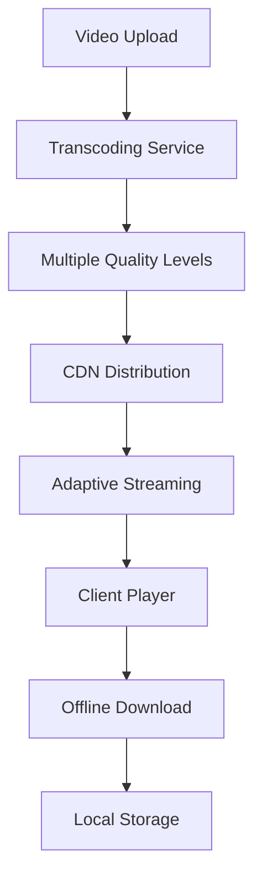

# IFL TAF Cohort 5 LMS Enhancement Requirements

## 1. Project Overview

This document outlines the comprehensive requirements for enhancing the UNDO LMS platform to meet the specific needs of the IFL TAF Cohort 5 program, focusing on SME training delivery outside Addis Ababa with consideration for low-bandwidth environments and offline accessibility.

**Current Platform**: UNDO LMS (Laravel-based)
**Target Users**: Small and Medium Enterprises (SMEs) outside Addis Ababa
**Key Challenge**: Limited internet connectivity and bandwidth constraints
**Program Duration**: Cohort 5 program timeline

## 2. Core Enhancement Requirements

### 2.1 Platform Accessibility & Device Support

#### Multi-Device Compatibility
| Device Type | Requirements | Priority |
|-------------|--------------|----------|
| Desktop/Laptop | Full functionality, responsive design | High |
| Tablets | Touch-optimized interface, offline sync | High |
| Smartphones | Mobile-first design, data-efficient loading | High |
| Low-spec devices | Lightweight interface, minimal resource usage | Medium |

#### Low-Bandwidth Optimization
- **Progressive Web App (PWA)** implementation for offline capabilities
- **Adaptive streaming** for video content based on connection speed
- **Content compression** and lazy loading for images and documents
- **Offline-first architecture** with background synchronization

### 2.2 Content Integration & Management

#### Supported Content Types
| Content Type | Format Support | Offline Access | Storage Requirements |
|--------------|----------------|----------------|---------------------|
| Video Sessions | MP4, WebM, HLS streaming | Downloadable chunks | High priority caching |
| Documents | PDF, DOC, DOCX, PPT, PPTX | Full offline access | Local storage |
| Presentations | Interactive HTML5, PDF | Cached viewing | Medium priority |
| Interactive Elements | SCORM, xAPI, H5P | Limited offline | Sync when online |

#### Content Management Features
- **Bulk upload** capabilities for administrators
- **Content versioning** and update tracking
- **Secure storage** with access control
- **Content categorization** and tagging system
- **Search functionality** across all content types

### 2.3 User Management System

#### User Roles & Permissions
| Role | Permissions | Registration Method |
|------|-------------|--------------------|
| Super Admin | Full system access, user management | Direct creation |
| IFL Administrator | Course management, reporting, user oversight | Admin invitation |
| Trainer/Instructor | Content upload, student interaction, basic reporting | Admin approval |
| SME Learner | Course access, progress tracking, communication | Self-registration with approval |
| Guest User | Limited preview access | Open registration |

#### SME-Specific Features
- **Bulk user registration** for SME groups
- **Organization-based grouping** for SMEs
- **Regional categorization** for location-based analytics
- **Offline user authentication** with periodic sync

### 2.4 Progress Tracking & Analytics

#### Learner Progress Metrics
- **Course completion percentage** with module-level tracking
- **Time spent** on each learning resource
- **Engagement metrics** (video watch time, document views, quiz attempts)
- **Learning path progression** with prerequisites
- **Offline activity tracking** with sync capabilities

#### Reporting Dashboard
| Report Type | Frequency | Audience | Export Formats |
|-------------|-----------|----------|----------------|
| Individual Progress | Real-time | Learners, Trainers | PDF, CSV |
| Cohort Analytics | Weekly/Monthly | IFL Team | Excel, PDF |
| Engagement Reports | Daily/Weekly | Administrators | Dashboard, CSV |
| Completion Certificates | On-demand | Learners | PDF with verification |

### 2.5 Communication & Collaboration Tools

#### Core Communication Features
- **Discussion Forums** with offline message queuing
- **Q&A Sections** with expert moderation
- **Direct messaging** between learners and trainers
- **Announcement system** with push notifications
- **Group collaboration spaces** for SME cohorts

#### Offline Communication Support
- **Message queuing** for offline composition
- **Automatic sync** when connection is restored
- **SMS integration** for critical notifications in low-connectivity areas

### 2.6 Offline Accessibility Solutions

#### Progressive Web App (PWA) Features
```javascript
// Service Worker Implementation
- Content caching strategy
- Background sync for user progress
- Offline-first data management
- Push notification support
```

#### Downloadable Content Management
- **Selective download** of course materials
- **Storage management** with user-controlled cache limits
- **Content expiration** and automatic updates
- **Copyright protection** with DRM for sensitive materials

#### Mobile App Considerations
- **Native mobile app** for enhanced offline capabilities
- **Content synchronization** when connectivity is available
- **Local database** for offline data storage
- **Bandwidth monitoring** and adaptive content delivery

## 3. Technical Implementation Plan

### 3.1 Backend Enhancements

#### Database Schema Extensions
```sql
-- Offline sync tracking
CREATE TABLE offline_sync_queue (
    id BIGINT PRIMARY KEY,
    user_id BIGINT,
    action_type VARCHAR(50),
    data JSON,
    sync_status ENUM('pending', 'synced', 'failed'),
    created_at TIMESTAMP,
    synced_at TIMESTAMP
);

-- Content download tracking
CREATE TABLE content_downloads (
    id BIGINT PRIMARY KEY,
    user_id BIGINT,
    content_id BIGINT,
    download_status ENUM('queued', 'downloading', 'completed', 'failed'),
    file_size BIGINT,
    downloaded_at TIMESTAMP
);

-- SME organization management
CREATE TABLE sme_organizations (
    id BIGINT PRIMARY KEY,
    name VARCHAR(255),
    location VARCHAR(255),
    contact_person VARCHAR(255),
    connectivity_level ENUM('high', 'medium', 'low'),
    created_at TIMESTAMP
);
```

#### API Enhancements
- **RESTful API** with offline sync endpoints
- **GraphQL integration** for efficient data fetching
- **WebSocket support** for real-time communication
- **Rate limiting** and bandwidth optimization

### 3.2 Frontend Enhancements

#### Progressive Web App Implementation
- **Service Worker** for caching and offline functionality
- **IndexedDB** for local data storage
- **Background Sync** for progress tracking
- **Push Notifications** for engagement

#### Responsive Design Improvements
- **Mobile-first approach** with touch optimization
- **Adaptive layouts** for various screen sizes
- **Gesture support** for mobile navigation
- **Voice-over accessibility** for inclusive design

### 3.3 Video Integration Architecture

#### Video Streaming Solutions


#### Video Features
- **Adaptive bitrate streaming** based on connection speed
- **Video chapters** and bookmarking
- **Subtitle support** in multiple languages
- **Playback speed control** for different learning preferences
- **Download for offline viewing** with quality selection

## 4. Implementation Phases

### Phase 1: Core Infrastructure (Weeks 1-4)
- PWA implementation and service worker setup
- Database schema enhancements
- Basic offline sync functionality
- User management system upgrades

### Phase 2: Content Management (Weeks 5-8)
- Video integration and streaming setup
- Content upload and management interface
- Offline content download system
- Search and categorization features

### Phase 3: Learning Features (Weeks 9-12)
- Progress tracking implementation
- Reporting dashboard development
- Communication tools integration
- Mobile app development (if required)

### Phase 4: Testing & Optimization (Weeks 13-16)
- Low-bandwidth environment testing
- User acceptance testing with SMEs
- Performance optimization
- Security auditing and compliance

### Phase 5: Deployment & Training (Weeks 17-20)
- Production deployment
- Administrator training program
- User onboarding materials
- Technical support setup

## 5. Technical Specifications

### 5.1 System Requirements

#### Server Infrastructure
- **Web Server**: Nginx with Laravel optimization
- **Database**: MySQL 8.0+ with replication
- **Caching**: Redis for session and application caching
- **File Storage**: AWS S3 or local storage with CDN
- **Video Processing**: FFmpeg for transcoding

#### Client Requirements
- **Browsers**: Chrome 80+, Firefox 75+, Safari 13+, Edge 80+
- **Mobile**: iOS 12+, Android 8+
- **Storage**: Minimum 2GB available for offline content
- **Bandwidth**: Adaptive from 56kbps to broadband

### 5.2 Security & Compliance

#### Data Protection
- **HTTPS encryption** for all communications
- **Content DRM** for proprietary training materials
- **User data privacy** compliance with local regulations
- **Secure offline storage** with encryption

#### Access Control
- **Multi-factor authentication** for administrators
- **Role-based permissions** with granular controls
- **Session management** with automatic timeout
- **Audit logging** for all user activities

## 6. Training & Support Documentation

### 6.1 Administrator Training Materials

#### Training Modules
1. **Platform Overview** - System navigation and basic concepts
2. **User Management** - Creating and managing SME accounts
3. **Content Management** - Uploading and organizing learning materials
4. **Progress Monitoring** - Using analytics and reporting tools
5. **Communication Tools** - Managing forums and messaging
6. **Technical Troubleshooting** - Common issues and solutions

#### Documentation Deliverables
- **Administrator Manual** (PDF and interactive web version)
- **Video Tutorials** for each major function
- **Quick Reference Guides** for daily operations
- **Troubleshooting Flowcharts** for technical issues

### 6.2 Learner Support Materials

#### User Guides
- **Getting Started Guide** for new SME users
- **Offline Learning Guide** for low-connectivity environments
- **Mobile App Usage** instructions and tips
- **FAQ Section** addressing common questions

#### Technical Support
- **Help Desk System** with ticket tracking
- **Live Chat Support** during business hours
- **Remote Assistance** capabilities for technical issues
- **Community Forum** for peer-to-peer support

## 7. Success Metrics & KPIs

### 7.1 Platform Performance Metrics
- **Page Load Time**: < 3 seconds on 3G connection
- **Offline Sync Success Rate**: > 95%
- **Video Streaming Quality**: Adaptive based on bandwidth
- **System Uptime**: > 99.5%

### 7.2 User Engagement Metrics
- **Course Completion Rate**: Target > 80%
- **Daily Active Users**: Track engagement patterns
- **Content Consumption**: Video watch time and document views
- **Communication Activity**: Forum posts and Q&A participation

### 7.3 Learning Effectiveness Metrics
- **Knowledge Retention**: Pre/post assessment scores
- **Skill Application**: Practical assignment completion
- **Learner Satisfaction**: Survey scores and feedback
- **SME Business Impact**: Post-training performance indicators

## 8. Risk Management & Mitigation

### 8.1 Technical Risks
| Risk | Impact | Probability | Mitigation Strategy |
|------|--------|-------------|--------------------|
| Connectivity Issues | High | High | Robust offline functionality, content caching |
| Server Downtime | High | Low | Redundant infrastructure, automated backups |
| Data Loss | High | Low | Regular backups, data replication |
| Security Breaches | Medium | Low | Security audits, encryption, access controls |

### 8.2 User Adoption Risks
| Risk | Impact | Probability | Mitigation Strategy |
|------|--------|-------------|--------------------|
| Low Digital Literacy | Medium | Medium | Comprehensive training, intuitive UI design |
| Resistance to Change | Medium | Medium | Change management, stakeholder engagement |
| Technical Support Needs | Medium | High | Dedicated support team, extensive documentation |

## 9. Budget Considerations

### 9.1 Development Costs
- **Platform Enhancement**: Custom development and integration
- **Infrastructure Setup**: Server, CDN, and storage costs
- **Third-party Services**: Video streaming, analytics tools
- **Testing & QA**: Comprehensive testing across devices and networks

### 9.2 Ongoing Operational Costs
- **Hosting & Infrastructure**: Monthly server and bandwidth costs
- **Technical Support**: Dedicated support team for Cohort 5 duration
- **Content Delivery**: CDN and video streaming costs
- **Maintenance & Updates**: Regular platform updates and security patches

## 10. Conclusion

The enhancement of the UNDO LMS platform for IFL TAF Cohort 5 represents a comprehensive undertaking that addresses the unique challenges of delivering quality education to SMEs in low-connectivity environments outside Addis Ababa. The proposed solution balances robust functionality with practical constraints, ensuring that learning can continue regardless of internet availability while maintaining high standards of user experience and educational effectiveness.

The success of this implementation will depend on careful attention to the specific needs of the target audience, thorough testing in real-world conditions, and ongoing support throughout the program duration. With proper execution, this enhanced LMS platform will serve as a model for educational technology deployment in challenging connectivity environments.