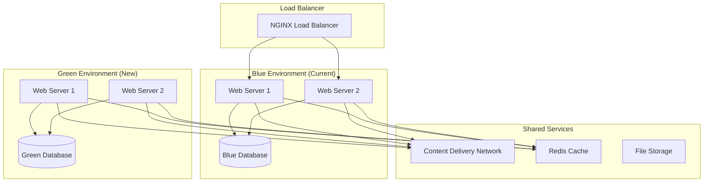
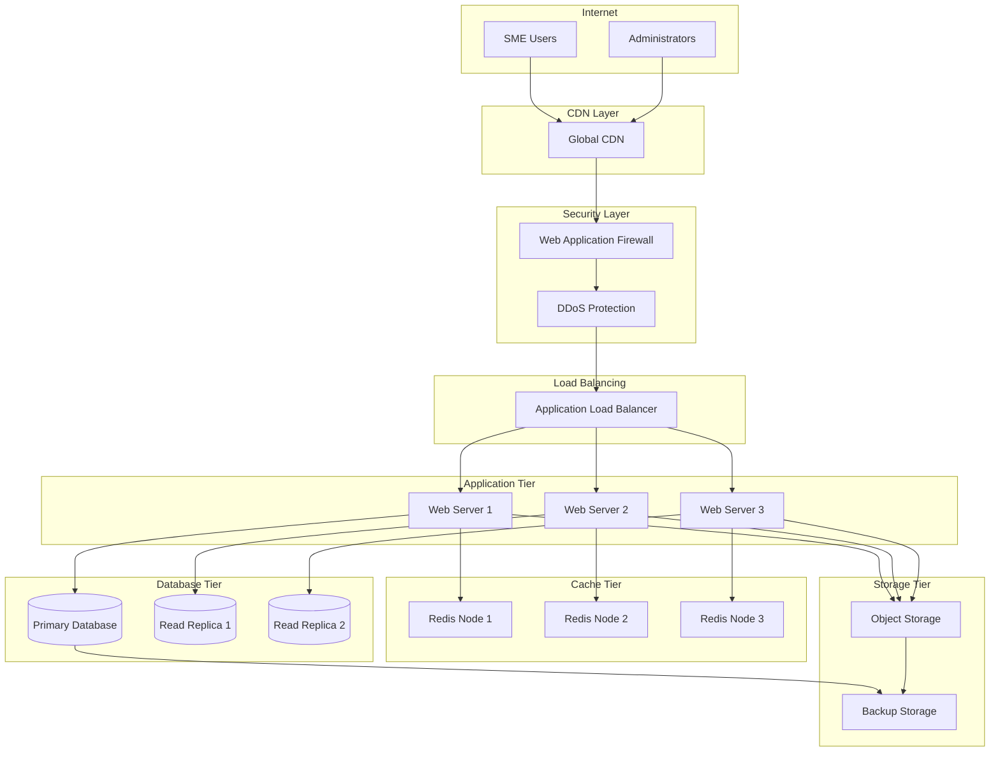

# IFL TAF Cohort 5 LMS Deployment & Maintenance Plan

## Table of Contents

1. [Deployment Strategy](#1-deployment-strategy)
2. [Infrastructure Architecture](#2-infrastructure-architecture)
3. [Security Implementation](#3-security-implementation)
4. [Performance Optimization](#4-performance-optimization)
5. [Monitoring & Analytics](#5-monitoring--analytics)
6. [Backup & Disaster Recovery](#6-backup--disaster-recovery)
7. [Maintenance Procedures](#7-maintenance-procedures)
8. [Support & Escalation](#8-support--escalation)
9. [Scaling & Growth Planning](#9-scaling--growth-planning)
10. [Long-term Sustainability](#10-long-term-sustainability)

## 1. Deployment Strategy

### 1.1 Deployment Phases

#### Phase 1: Infrastructure Setup (Week 17)
**Objectives:**
- Establish production infrastructure
- Configure security and monitoring systems
- Implement backup and disaster recovery

**Activities:**
- Cloud infrastructure provisioning
- Network security configuration
- SSL certificate installation
- Monitoring system deployment
- Backup system implementation

**Success Criteria:**
- All infrastructure components operational
- Security scans pass with no critical vulnerabilities
- Monitoring systems collecting baseline metrics
- Backup procedures tested and verified

#### Phase 2: Application Deployment (Week 18)
**Objectives:**
- Deploy UNDO LMS application to production
- Configure application-specific settings
- Implement content delivery optimization

**Activities:**
- Application code deployment
- Database migration and optimization
- CDN configuration and testing
- Application performance tuning
- Integration testing with external services

**Success Criteria:**
- Application fully functional in production
- All features working as expected
- Performance benchmarks met
- Integration points operational

#### Phase 3: Content Migration & Testing (Week 19)
**Objectives:**
- Migrate existing content to production
- Conduct comprehensive testing
- Validate offline functionality

**Activities:**
- Content upload and organization
- User account creation and testing
- Offline functionality validation
- Performance testing under load
- User acceptance testing

**Success Criteria:**
- All content successfully migrated
- User acceptance testing completed
- Offline functionality verified
- Performance requirements met

#### Phase 4: Go-Live & Stabilization (Week 20)
**Objectives:**
- Launch platform for production use
- Monitor system stability
- Provide immediate support

**Activities:**
- Production launch announcement
- User onboarding and training
- Real-time monitoring and support
- Issue resolution and optimization
- Feedback collection and analysis

**Success Criteria:**
- Successful production launch
- System stability maintained
- User adoption targets met
- Critical issues resolved promptly

### 1.2 Deployment Architecture

#### Blue-Green Deployment Strategy
**Approach**: Maintain two identical production environments
**Benefits**:
- Zero-downtime deployments
- Instant rollback capability
- Reduced deployment risk
- Comprehensive testing in production-like environment

**Implementation**:


#### Deployment Automation
**CI/CD Pipeline Components**:
- **Source Control**: Git with feature branch workflow
- **Build System**: GitHub Actions for automated builds
- **Testing**: Automated unit, integration, and end-to-end tests
- **Deployment**: Automated deployment with approval gates
- **Monitoring**: Automated health checks and rollback triggers

**Pipeline Stages**:
1. **Code Commit**: Developer pushes code to feature branch
2. **Automated Testing**: Unit tests, integration tests, security scans
3. **Build & Package**: Application build and containerization
4. **Staging Deployment**: Automatic deployment to staging environment
5. **Quality Assurance**: Manual testing and approval
6. **Production Deployment**: Blue-green deployment to production
7. **Health Verification**: Automated health checks and monitoring
8. **Traffic Switch**: Gradual traffic migration to new version

### 1.3 Environment Configuration

#### Production Environment Specifications

**Web Servers (2x instances)**
- **Instance Type**: 4 vCPU, 16GB RAM, 100GB SSD
- **Operating System**: Ubuntu 22.04 LTS
- **Web Server**: NGINX with PHP-FPM
- **PHP Version**: 8.2 with optimized configuration
- **Auto-scaling**: Horizontal scaling based on CPU/memory usage

**Database Cluster**
- **Primary Instance**: 8 vCPU, 32GB RAM, 500GB SSD
- **Read Replicas**: 2x instances (4 vCPU, 16GB RAM each)
- **Database Engine**: MySQL 8.0 with InnoDB storage
- **Backup Strategy**: Automated daily backups with point-in-time recovery

**Cache Layer**
- **Redis Cluster**: 3 nodes for high availability
- **Instance Specs**: 2 vCPU, 8GB RAM per node
- **Configuration**: Optimized for session storage and application caching

**Content Delivery**
- **CDN Provider**: CloudFlare or AWS CloudFront
- **Storage**: AWS S3 or compatible object storage
- **Video Streaming**: Adaptive bitrate streaming with multiple quality levels

**Load Balancer**
- **Type**: Application Load Balancer with SSL termination
- **Health Checks**: Automated health monitoring and failover
- **SSL Configuration**: TLS 1.3 with strong cipher suites

## 2. Infrastructure Architecture

### 2.1 Cloud Infrastructure Design

#### Multi-Region Architecture
**Primary Region**: East Africa (if available) or Europe
**Secondary Region**: Backup region for disaster recovery

**Benefits**:
- Reduced latency for Ethiopian users
- Improved reliability and availability
- Disaster recovery capabilities
- Compliance with data residency requirements

#### Network Architecture


### 2.2 Containerization Strategy

#### Docker Configuration
**Base Images**:
- **Web Application**: PHP 8.2-FPM with Alpine Linux
- **Web Server**: NGINX with optimized configuration
- **Database**: MySQL 8.0 official image
- **Cache**: Redis 7.0 official image

**Container Orchestration**:
- **Platform**: Docker Compose for development, Kubernetes for production
- **Service Mesh**: Istio for advanced traffic management (optional)
- **Container Registry**: Private registry for secure image storage

#### Kubernetes Deployment (Production)
```yaml
apiVersion: apps/v1
kind: Deployment
metadata:
  name: undo-lms-web
spec:
  replicas: 3
  selector:
    matchLabels:
      app: undo-lms-web
  template:
    metadata:
      labels:
        app: undo-lms-web
    spec:
      containers:
      - name: web
        image: undo-lms:latest
        ports:
        - containerPort: 9000
        env:
        - name: DB_HOST
          value: "mysql-service"
        - name: REDIS_HOST
          value: "redis-service"
        resources:
          requests:
            memory: "512Mi"
            cpu: "250m"
          limits:
            memory: "2Gi"
            cpu: "1000m"
```

### 2.3 Infrastructure as Code

#### Terraform Configuration
**Infrastructure Components**:
- VPC and networking configuration
- Security groups and firewall rules
- Load balancer and auto-scaling groups
- Database cluster and read replicas
- Storage buckets and CDN configuration

**Benefits**:
- Reproducible infrastructure deployments
- Version-controlled infrastructure changes
- Automated disaster recovery setup
- Consistent environments across stages

#### Ansible Playbooks
**Configuration Management**:
- Server provisioning and configuration
- Application deployment automation
- Security hardening procedures
- Monitoring agent installation

## 3. Security Implementation

### 3.1 Security Architecture

#### Defense in Depth Strategy
**Layer 1: Network Security**
- Web Application Firewall (WAF) with custom rules
- DDoS protection and rate limiting
- VPN access for administrative functions
- Network segmentation and access controls

**Layer 2: Application Security**
- Input validation and sanitization
- SQL injection prevention
- Cross-site scripting (XSS) protection
- Cross-site request forgery (CSRF) protection

**Layer 3: Data Security**
- Encryption at rest and in transit
- Database access controls and auditing
- Secure file storage with access controls
- Personal data protection and privacy

**Layer 4: Identity & Access Management**
- Multi-factor authentication (MFA)
- Role-based access control (RBAC)
- Session management and timeout
- Password policy enforcement

### 3.2 Security Controls Implementation

#### Authentication & Authorization
**Multi-Factor Authentication**:
- SMS-based OTP for high-privilege accounts
- Time-based OTP (TOTP) app support
- Backup codes for account recovery
- Conditional access based on location/device

**Role-Based Access Control**:
```php
// Example RBAC implementation
class RolePermissionMatrix {
    const PERMISSIONS = [
        'super_admin' => ['*'],
        'admin' => [
            'users.manage',
            'content.manage',
            'reports.view',
            'settings.configure'
        ],
        'instructor' => [
            'content.create',
            'content.edit_own',
            'students.view',
            'reports.view_own'
        ],
        'student' => [
            'content.view',
            'progress.track',
            'forum.participate'
        ]
    ];
}
```

#### Data Protection
**Encryption Standards**:
- **At Rest**: AES-256 encryption for database and file storage
- **In Transit**: TLS 1.3 for all communications
- **Application Level**: Encrypted sensitive fields in database
- **Key Management**: Hardware Security Module (HSM) or cloud KMS

**Privacy Controls**:
- Data minimization and purpose limitation
- User consent management
- Right to erasure ("right to be forgotten")
- Data portability and export capabilities

### 3.3 Security Monitoring & Incident Response

#### Security Information and Event Management (SIEM)
**Log Collection**:
- Application logs with security events
- Web server access and error logs
- Database audit logs
- System and network logs

**Threat Detection**:
- Anomaly detection for user behavior
- Brute force attack detection
- SQL injection attempt monitoring
- Unusual data access patterns

#### Incident Response Plan
**Response Team Structure**:
- **Incident Commander**: Overall response coordination
- **Technical Lead**: Technical investigation and remediation
- **Communications Lead**: Stakeholder communication
- **Legal/Compliance**: Regulatory and legal considerations

**Response Procedures**:
1. **Detection & Analysis** (0-1 hour)
   - Incident identification and classification
   - Initial impact assessment
   - Evidence collection and preservation

2. **Containment & Eradication** (1-4 hours)
   - Immediate threat containment
   - System isolation if necessary
   - Threat removal and system cleaning

3. **Recovery & Post-Incident** (4-24 hours)
   - System restoration and validation
   - Monitoring for recurring issues
   - Incident documentation and lessons learned

## 4. Performance Optimization

### 4.1 Application Performance

#### Database Optimization
**Query Optimization**:
- Index optimization for frequently accessed data
- Query caching for repeated operations
- Database connection pooling
- Read/write splitting for improved performance

**Caching Strategy**:
```php
// Multi-level caching implementation
class CacheManager {
    public function get($key) {
        // Level 1: Application cache (Redis)
        if ($value = $this->redis->get($key)) {
            return $value;
        }
        
        // Level 2: Database query cache
        if ($value = $this->queryCache->get($key)) {
            $this->redis->setex($key, 3600, $value);
            return $value;
        }
        
        // Level 3: Generate from source
        $value = $this->generateValue($key);
        $this->redis->setex($key, 3600, $value);
        return $value;
    }
}
```

#### Frontend Optimization
**Asset Optimization**:
- JavaScript and CSS minification
- Image compression and WebP format support
- Lazy loading for images and videos
- Critical CSS inlining for faster rendering

**Progressive Web App Optimization**:
- Service worker caching strategies
- Background sync for offline actions
- Push notification optimization
- App shell architecture for instant loading

### 4.2 Content Delivery Optimization

#### Video Streaming Optimization
**Adaptive Bitrate Streaming**:
- Multiple quality levels (360p, 480p, 720p, 1080p)
- Automatic quality adjustment based on bandwidth
- Video segmentation for efficient delivery
- Thumbnail generation for video previews

**Content Compression**:
- Gzip compression for text-based content
- Brotli compression for modern browsers
- Video transcoding with optimal settings
- Image optimization with multiple formats

#### CDN Configuration
**Caching Rules**:
```nginx
# Static assets - long cache
location ~* \.(jpg|jpeg|png|gif|ico|css|js)$ {
    expires 1y;
    add_header Cache-Control "public, immutable";
}

# Video content - medium cache
location ~* \.(mp4|webm|ogg)$ {
    expires 30d;
    add_header Cache-Control "public";
}

# API responses - short cache
location /api/ {
    expires 5m;
    add_header Cache-Control "public";
}
```

### 4.3 Performance Monitoring

#### Key Performance Indicators
**User Experience Metrics**:
- **First Contentful Paint (FCP)**: < 1.5 seconds
- **Largest Contentful Paint (LCP)**: < 2.5 seconds
- **First Input Delay (FID)**: < 100 milliseconds
- **Cumulative Layout Shift (CLS)**: < 0.1

**System Performance Metrics**:
- **Response Time**: 95th percentile < 500ms
- **Throughput**: > 1000 requests per second
- **Error Rate**: < 0.1% for critical operations
- **Availability**: > 99.9% uptime

#### Performance Testing
**Load Testing Strategy**:
- **Baseline Testing**: Normal expected load
- **Stress Testing**: Peak load scenarios
- **Spike Testing**: Sudden traffic increases
- **Volume Testing**: Large data set handling

**Testing Tools**:
- **Apache JMeter**: Load testing and performance measurement
- **Lighthouse**: Web performance auditing
- **WebPageTest**: Real-world performance testing
- **New Relic/DataDog**: Application performance monitoring

## 5. Monitoring & Analytics

### 5.1 System Monitoring

#### Infrastructure Monitoring
**Server Metrics**:
- CPU utilization and load average
- Memory usage and swap utilization
- Disk I/O and storage capacity
- Network throughput and latency

**Application Metrics**:
- Response time and throughput
- Error rates and exception tracking
- Database query performance
- Cache hit rates and efficiency

#### Monitoring Stack
```yaml
# Prometheus configuration for metrics collection
global:
  scrape_interval: 15s
  evaluation_interval: 15s

scrape_configs:
  - job_name: 'undo-lms'
    static_configs:
      - targets: ['web-server-1:9090', 'web-server-2:9090']
  
  - job_name: 'mysql'
    static_configs:
      - targets: ['mysql-exporter:9104']
  
  - job_name: 'redis'
    static_configs:
      - targets: ['redis-exporter:9121']
```

### 5.2 Application Analytics

#### User Behavior Analytics
**Learning Analytics**:
- Course completion rates and progression
- Video engagement and watch time
- Assessment performance and attempts
- Forum participation and interaction

**Usage Patterns**:
- Peak usage times and seasonal trends
- Device and browser usage statistics
- Geographic distribution of users
- Feature adoption and usage frequency

#### Business Intelligence Dashboard
**Key Metrics Visualization**:
- Real-time user activity and engagement
- Course effectiveness and completion rates
- System performance and health status
- Revenue and cost optimization insights

### 5.3 Alerting & Notification

#### Alert Configuration
**Critical Alerts** (Immediate Response):
- System downtime or service unavailability
- Database connection failures
- High error rates (> 5% in 5 minutes)
- Security incidents or breach attempts

**Warning Alerts** (Response within 1 hour):
- High resource utilization (> 80%)
- Slow response times (> 2 seconds)
- Low disk space (< 20% remaining)
- Failed backup operations

**Information Alerts** (Daily Summary):
- Daily usage statistics
- Performance trend reports
- Capacity planning recommendations
- Security scan results

#### Notification Channels
**Primary Channels**:
- **Email**: Detailed alert information and reports
- **SMS**: Critical alerts for immediate attention
- **Slack/Teams**: Team collaboration and updates
- **Dashboard**: Real-time status visualization

## 6. Backup & Disaster Recovery

### 6.1 Backup Strategy

#### Database Backup
**Automated Backup Schedule**:
- **Full Backup**: Daily at 2:00 AM local time
- **Incremental Backup**: Every 6 hours
- **Transaction Log Backup**: Every 15 minutes
- **Retention Policy**: 30 days online, 1 year archived

**Backup Verification**:
- Automated backup integrity checks
- Monthly restore testing procedures
- Backup encryption and secure storage
- Cross-region backup replication

#### File System Backup
**Content Backup Strategy**:
- **User Uploads**: Real-time replication to secondary storage
- **Application Files**: Daily backup with version control
- **Configuration Files**: Automated backup on changes
- **Log Files**: Compressed and archived weekly

### 6.2 Disaster Recovery Plan

#### Recovery Time Objectives (RTO)
- **Critical Systems**: 4 hours maximum downtime
- **Non-Critical Systems**: 24 hours maximum downtime
- **Data Recovery**: 1 hour maximum data loss (RPO)

#### Recovery Procedures
**Scenario 1: Single Server Failure**
1. **Detection**: Automated monitoring alerts (< 5 minutes)
2. **Failover**: Load balancer redirects traffic (< 2 minutes)
3. **Investigation**: Root cause analysis and repair
4. **Recovery**: Server replacement or repair (< 4 hours)

**Scenario 2: Database Failure**
1. **Detection**: Database monitoring alerts (< 2 minutes)
2. **Failover**: Promote read replica to primary (< 10 minutes)
3. **Data Verification**: Ensure data consistency
4. **Recovery**: Rebuild failed database server

**Scenario 3: Complete Data Center Failure**
1. **Detection**: Multi-system failure alerts (< 10 minutes)
2. **Activation**: Disaster recovery site activation (< 2 hours)
3. **Data Restore**: Latest backup restoration (< 4 hours)
4. **Service Verification**: Full system testing and validation

### 6.3 Business Continuity

#### Communication Plan
**Stakeholder Notification**:
- **Internal Team**: Immediate notification via multiple channels
- **Users**: Status page updates and email notifications
- **Management**: Executive briefings and impact assessments
- **Partners**: Vendor and service provider coordination

**Communication Templates**:
```
Subject: [URGENT] UNDO LMS Service Disruption - [Incident ID]

Dear UNDO LMS Users,

We are currently experiencing a service disruption affecting [affected services]. 
Our technical team is actively working to resolve the issue.

Estimated Resolution Time: [ETA]
Affected Services: [List]
Workaround: [If available]

We will provide updates every 30 minutes until resolution.

Status Page: [URL]
Support Contact: [Contact Information]

We apologize for any inconvenience caused.

UNDO LMS Technical Team
```

## 7. Maintenance Procedures

### 7.1 Routine Maintenance

#### Daily Maintenance Tasks
**Automated Procedures**:
- System health checks and monitoring
- Backup verification and status reporting
- Log rotation and cleanup
- Security scan execution
- Performance metrics collection

**Manual Procedures**:
- Critical alert review and response
- User support ticket triage
- System performance analysis
- Security incident investigation

#### Weekly Maintenance Tasks
**System Optimization**:
- Database maintenance and optimization
- Cache cleanup and optimization
- Storage cleanup and archival
- Performance trend analysis

**Security Maintenance**:
- Security patch assessment and planning
- Access review and cleanup
- Vulnerability scan analysis
- Incident response plan review

#### Monthly Maintenance Tasks
**Comprehensive Review**:
- Full system performance review
- Capacity planning and scaling assessment
- Security audit and compliance check
- Disaster recovery testing

**Updates and Improvements**:
- Software updates and patches
- Configuration optimization
- Documentation updates
- Training and knowledge sharing

### 7.2 Update Management

#### Security Updates
**Critical Security Patches**:
- **Assessment**: Within 24 hours of release
- **Testing**: Emergency testing procedures
- **Deployment**: Within 72 hours for critical patches
- **Verification**: Post-deployment security validation

**Regular Security Updates**:
- **Monthly Cycle**: Scheduled maintenance windows
- **Testing**: Comprehensive testing in staging
- **Deployment**: Blue-green deployment strategy
- **Rollback**: Immediate rollback capability

#### Feature Updates
**Release Schedule**:
- **Major Releases**: Quarterly with new features
- **Minor Releases**: Monthly with improvements
- **Patch Releases**: As needed for bug fixes
- **Hotfixes**: Emergency fixes for critical issues

**Update Process**:
1. **Development**: Feature development and testing
2. **Staging**: Deployment to staging environment
3. **User Acceptance**: Testing with stakeholders
4. **Production**: Scheduled deployment to production
5. **Monitoring**: Post-deployment monitoring and support

### 7.3 Maintenance Windows

#### Scheduled Maintenance
**Regular Maintenance Window**:
- **Schedule**: Every Sunday 2:00 AM - 6:00 AM local time
- **Duration**: Maximum 4 hours
- **Notification**: 72 hours advance notice
- **Scope**: Non-emergency updates and maintenance

**Emergency Maintenance**:
- **Trigger**: Critical security or stability issues
- **Notification**: Minimum 2 hours notice when possible
- **Duration**: As required for issue resolution
- **Communication**: Real-time status updates

#### Maintenance Procedures
**Pre-Maintenance Checklist**:
- [ ] Backup verification and validation
- [ ] Rollback plan preparation
- [ ] Stakeholder notification
- [ ] Maintenance team coordination
- [ ] Testing environment validation

**Post-Maintenance Checklist**:
- [ ] System functionality verification
- [ ] Performance metrics validation
- [ ] User acceptance confirmation
- [ ] Documentation updates
- [ ] Lessons learned documentation

## 8. Support & Escalation

### 8.1 Support Structure

#### Support Team Organization
**Level 1 Support (Help Desk)**:
- **Staffing**: 2-3 support agents
- **Hours**: 8 AM - 6 PM local time (Monday-Friday)
- **Responsibilities**: User account issues, basic troubleshooting
- **Response Time**: 2 hours for standard issues

**Level 2 Support (Technical)**:
- **Staffing**: 2 technical specialists
- **Hours**: 24/7 on-call rotation
- **Responsibilities**: System issues, advanced troubleshooting
- **Response Time**: 1 hour for urgent issues

**Level 3 Support (Engineering)**:
- **Staffing**: Development team members
- **Hours**: On-call for critical issues
- **Responsibilities**: Code issues, architecture problems
- **Response Time**: 30 minutes for critical issues

#### Escalation Matrix

| Issue Severity | Response Time | Escalation Path | Notification |
|----------------|---------------|-----------------|-------------|
| **Critical** | 15 minutes | L1 → L2 → L3 → Management | Immediate |
| **High** | 1 hour | L1 → L2 → L3 | Within 2 hours |
| **Medium** | 4 hours | L1 → L2 | Next business day |
| **Low** | 24 hours | L1 | Weekly summary |

### 8.2 Issue Classification

#### Severity Definitions
**Critical (P1)**:
- Complete system outage
- Security breach or data loss
- Payment system failure
- Affects > 50% of users

**High (P2)**:
- Major feature unavailable
- Performance severely degraded
- Affects 10-50% of users
- Workaround available but difficult

**Medium (P3)**:
- Minor feature issues
- Performance slightly degraded
- Affects < 10% of users
- Easy workaround available

**Low (P4)**:
- Cosmetic issues
- Feature enhancement requests
- Documentation updates
- No user impact

### 8.3 Support Tools & Processes

#### Ticketing System
**Ticket Management**:
- Automated ticket creation from monitoring alerts
- User self-service portal for issue submission
- SLA tracking and escalation automation
- Knowledge base integration

**Ticket Workflow**:
1. **Creation**: Automatic or manual ticket creation
2. **Triage**: Initial assessment and priority assignment
3. **Assignment**: Route to appropriate support level
4. **Investigation**: Problem analysis and diagnosis
5. **Resolution**: Issue fix and verification
6. **Closure**: User confirmation and documentation

#### Communication Channels
**Internal Communication**:
- **Slack/Teams**: Real-time team coordination
- **Email**: Formal communication and documentation
- **Video Calls**: Complex issue collaboration
- **Status Dashboard**: Real-time system status

**External Communication**:
- **Support Portal**: User ticket submission and tracking
- **Status Page**: Public system status and updates
- **Email Notifications**: Automated status updates
- **Phone Support**: Critical issue escalation

## 9. Scaling & Growth Planning

### 9.1 Capacity Planning

#### Growth Projections
**User Growth Forecast**:
- **Year 1**: 500 active users (baseline)
- **Year 2**: 1,500 active users (3x growth)
- **Year 3**: 3,000 active users (6x growth)
- **Year 5**: 7,500 active users (15x growth)

**Resource Requirements**:

| Metric | Current | Year 1 | Year 2 | Year 3 | Year 5 |
|--------|---------|--------|--------|--------|---------|
| **Concurrent Users** | 50 | 150 | 450 | 900 | 2,250 |
| **Storage (TB)** | 1 | 3 | 9 | 18 | 45 |
| **Bandwidth (Gbps)** | 0.1 | 0.3 | 0.9 | 1.8 | 4.5 |
| **Database Size (GB)** | 10 | 30 | 90 | 180 | 450 |

#### Scaling Triggers
**Automatic Scaling**:
- **CPU Utilization**: > 70% for 5 minutes
- **Memory Usage**: > 80% for 5 minutes
- **Response Time**: > 2 seconds for 10 minutes
- **Queue Length**: > 100 pending requests

**Manual Scaling Review**:
- **Monthly**: Capacity utilization review
- **Quarterly**: Growth projection updates
- **Annually**: Infrastructure architecture review

### 9.2 Horizontal Scaling Strategy

#### Application Scaling
**Web Server Scaling**:
- Auto-scaling groups with load balancers
- Container orchestration with Kubernetes
- Microservices architecture for independent scaling
- Stateless application design for easy scaling

**Database Scaling**:
- Read replica scaling for read-heavy workloads
- Database sharding for write-heavy workloads
- Connection pooling and query optimization
- Caching layer expansion

#### Infrastructure Scaling
**Cloud-Native Scaling**:
```yaml
# Kubernetes Horizontal Pod Autoscaler
apiVersion: autoscaling/v2
kind: HorizontalPodAutoscaler
metadata:
  name: undo-lms-hpa
spec:
  scaleTargetRef:
    apiVersion: apps/v1
    kind: Deployment
    name: undo-lms-web
  minReplicas: 2
  maxReplicas: 10
  metrics:
  - type: Resource
    resource:
      name: cpu
      target:
        type: Utilization
        averageUtilization: 70
  - type: Resource
    resource:
      name: memory
      target:
        type: Utilization
        averageUtilization: 80
```

### 9.3 Performance Optimization for Scale

#### Caching Strategy Evolution
**Multi-Level Caching**:
- **L1**: Application-level caching (Redis)
- **L2**: Database query result caching
- **L3**: CDN edge caching
- **L4**: Browser caching optimization

**Cache Invalidation Strategy**:
- Time-based expiration for static content
- Event-driven invalidation for dynamic content
- Cache warming for frequently accessed data
- Distributed cache consistency management

#### Database Optimization
**Query Optimization**:
- Index optimization for growing datasets
- Query plan analysis and optimization
- Stored procedure implementation for complex operations
- Database partitioning for large tables

**Connection Management**:
- Connection pooling optimization
- Read/write splitting implementation
- Database proxy for connection management
- Query routing optimization

## 10. Long-term Sustainability

### 10.1 Technology Roadmap

#### Platform Evolution Strategy
**Short-term (6-12 months)**:
- Performance optimization and bug fixes
- User experience improvements
- Mobile app development
- Advanced analytics implementation

**Medium-term (1-2 years)**:
- AI-powered personalization
- Advanced collaboration features
- Integration with external systems
- Multi-language support

**Long-term (2-5 years)**:
- Machine learning for adaptive learning
- Virtual reality integration
- Blockchain for certification
- IoT device integration

#### Technology Stack Evolution
**Framework Updates**:
- Laravel framework updates and migrations
- PHP version upgrades and optimization
- Database engine updates and improvements
- Frontend technology modernization

**Infrastructure Modernization**:
- Cloud-native architecture adoption
- Serverless computing integration
- Edge computing implementation
- Green computing initiatives

### 10.2 Operational Sustainability

#### Cost Optimization
**Resource Optimization**:
- Automated resource scaling and optimization
- Reserved instance purchasing for predictable workloads
- Spot instance utilization for batch processing
- Storage lifecycle management and archival

**Operational Efficiency**:
- Automation of routine maintenance tasks
- Self-healing infrastructure implementation
- Predictive maintenance and monitoring
- DevOps process optimization

#### Team Development
**Knowledge Management**:
- Comprehensive documentation maintenance
- Knowledge transfer procedures
- Cross-training and skill development
- Community of practice establishment

**Succession Planning**:
- Key personnel backup and training
- Vendor relationship management
- External expertise partnerships
- Emergency response team development

### 10.3 Continuous Improvement

#### Feedback Loop Implementation
**User Feedback Collection**:
- Regular user surveys and interviews
- Usage analytics and behavior analysis
- Feature request tracking and prioritization
- A/B testing for feature optimization

**Performance Monitoring**:
- Continuous performance benchmarking
- Trend analysis and prediction
- Capacity planning and optimization
- Cost-benefit analysis for improvements

#### Innovation Pipeline
**Research and Development**:
- Emerging technology evaluation
- Proof of concept development
- Pilot program implementation
- Innovation partnership exploration

**Best Practice Adoption**:
- Industry standard compliance
- Security framework updates
- Performance optimization techniques
- User experience improvements

## Conclusion

This comprehensive deployment and maintenance plan ensures the successful launch and long-term sustainability of the enhanced UNDO LMS platform for IFL TAF Cohort 5. The plan addresses all critical aspects of production deployment, ongoing maintenance, and future growth while maintaining high standards of security, performance, and reliability.

**Key Success Factors**:

1. **Robust Infrastructure**: Scalable, secure, and highly available architecture
2. **Comprehensive Monitoring**: Proactive monitoring and alerting systems
3. **Efficient Operations**: Automated processes and clear procedures
4. **Strong Security**: Multi-layered security controls and incident response
5. **Continuous Improvement**: Regular optimization and enhancement cycles

**Expected Outcomes**:

- **99.9% Uptime**: Highly available platform for uninterrupted learning
- **Optimal Performance**: Fast, responsive user experience across all devices
- **Scalable Growth**: Seamless scaling to support increasing user base
- **Security Compliance**: Robust protection of user data and privacy
- **Cost Efficiency**: Optimized resource utilization and operational costs

The implementation of this plan will establish UNDO LMS as a reliable, scalable, and sustainable platform capable of supporting the IFL TAF Cohort 5 program and future educational initiatives while maintaining the highest standards of quality and security.