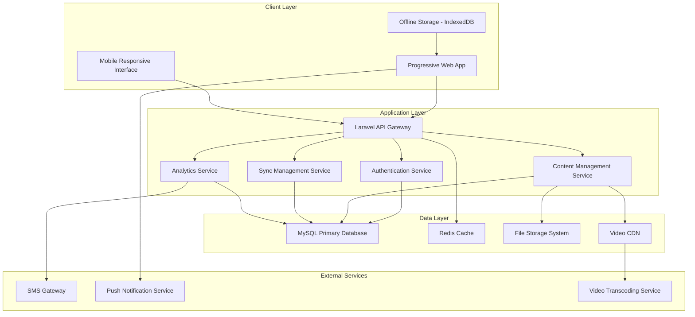

# IFL TAF Cohort 5 LMS Enhancement Project Proposal

## Executive Summary

This proposal outlines the comprehensive enhancement of the UNDO Learning Management System (LMS) to meet the specific requirements of the IFL TAF Cohort 5 program. The project focuses on delivering accessible, offline-capable education technology solutions for Small and Medium Enterprises (SMEs) located outside Addis Ababa, addressing the unique challenges of limited internet connectivity while maintaining high-quality learning experiences.

**Project Value Proposition:**
- Transform existing UNDO LMS into an enterprise-grade platform
- Enable effective learning in low-bandwidth environments
- Provide comprehensive SME training delivery system
- Ensure scalable solution for future cohorts

## 1. Project Overview

### 1.1 Current State Analysis

**Existing UNDO LMS Capabilities:**
- Laravel-based architecture with modern web technologies
- Basic course management and user enrollment
- Standard video and document content delivery
- Simple progress tracking and reporting
- Clean, rebranded interface with blue color scheme

**Current Limitations:**
- No offline accessibility features
- Limited bandwidth optimization
- Basic user management without organization grouping
- Minimal communication and collaboration tools
- No adaptive content delivery based on connectivity

### 1.2 Target State Vision

**Enhanced UNDO LMS for IFL TAF:**
- **Offline-First Architecture**: Full functionality without internet dependency
- **Adaptive Content Delivery**: Automatic quality adjustment based on bandwidth
- **SME-Focused User Management**: Organization-based grouping and analytics
- **Comprehensive Communication**: Forums, messaging, and collaboration tools
- **Advanced Analytics**: Detailed progress tracking and reporting
- **Mobile Optimization**: Progressive Web App with native-like experience

## 2. Business Case & Objectives

### 2.1 Primary Business Objectives

| Objective | Success Metric | Timeline |
|-----------|----------------|----------|
| Enable offline learning access | 100% core features available offline | Week 12 |
| Improve user engagement | 80%+ course completion rate | Week 16 |
| Reduce bandwidth dependency | 70% reduction in data usage | Week 10 |
| Enhance SME training delivery | Support 500+ concurrent users | Week 18 |
| Provide comprehensive analytics | Real-time reporting dashboard | Week 14 |

### 2.2 Key Performance Indicators (KPIs)

#### Technical KPIs
- **Page Load Time**: < 3 seconds on 2G connection
- **Offline Sync Success Rate**: > 95%
- **System Uptime**: > 99.5%
- **Mobile Performance Score**: > 90 (Lighthouse)
- **Bandwidth Efficiency**: 70% reduction in data consumption

#### Educational KPIs
- **Course Completion Rate**: > 80%
- **User Engagement Time**: Average 45+ minutes per session
- **Content Interaction Rate**: > 75% video completion
- **Forum Participation**: > 60% active users
- **Knowledge Retention**: > 85% assessment pass rate

#### Business KPIs
- **User Adoption Rate**: > 90% within first month
- **Support Ticket Volume**: < 5% of total users
- **Training Effectiveness**: Measurable SME performance improvement
- **Platform Scalability**: Support for 1000+ concurrent users

## 3. Scope of Work

### 3.1 Core Platform Enhancements

#### 3.1.1 Offline Accessibility Implementation
- **Progressive Web App (PWA)** development with service workers
- **Content caching strategies** for videos, documents, and course materials
- **Background synchronization** for user progress and interactions
- **Offline-first database** design with IndexedDB integration
- **Selective content download** with user-controlled storage management

#### 3.1.2 Adaptive Content Delivery
- **Bandwidth monitoring** and automatic quality adjustment
- **Multi-quality video streaming** (360p, 480p, 720p)
- **Content compression** and optimization algorithms
- **Lazy loading** implementation for improved performance
- **CDN integration** for global content distribution

#### 3.1.3 Enhanced User Management
- **SME organization grouping** with hierarchical permissions
- **Bulk user registration** and management tools
- **Role-based access control** (Admin, Instructor, Learner, Guest)
- **Regional categorization** for location-based analytics
- **User connectivity profiling** for personalized experience

### 3.2 Learning & Content Management

#### 3.2.1 Advanced Content Integration
- **Multi-format support**: Videos, documents, presentations, interactive content
- **Content versioning** and update management
- **Secure storage** with access control and DRM protection
- **Search and categorization** with advanced filtering
- **Content analytics** and usage tracking

#### 3.2.2 Interactive Learning Features
- **Video player enhancements**: Chapters, bookmarks, speed control
- **Subtitle support** in multiple languages
- **Interactive assessments** with offline capability
- **Learning path management** with prerequisites
- **Gamification elements**: Badges, achievements, leaderboards

### 3.3 Communication & Collaboration

#### 3.3.1 Forum System
- **Category-based discussions** with moderation tools
- **Q&A sections** with expert responses
- **Threaded conversations** with like/dislike functionality
- **Offline message composition** with sync when online
- **Search functionality** across all discussions

#### 3.3.2 Real-time Communication
- **Direct messaging** between users and instructors
- **Announcement system** with push notifications
- **Group collaboration spaces** for SME cohorts
- **SMS integration** for critical notifications in low-connectivity areas
- **Email notifications** with customizable preferences

### 3.4 Analytics & Reporting

#### 3.4.1 Learner Analytics
- **Detailed progress tracking** with time-based metrics
- **Engagement analytics**: Video watch time, content interactions
- **Learning pattern analysis** and recommendations
- **Offline activity tracking** with comprehensive sync
- **Performance benchmarking** against cohort averages

#### 3.4.2 Administrative Reporting
- **Real-time dashboard** with key metrics visualization
- **Cohort performance reports** with drill-down capabilities
- **Content effectiveness analysis** and optimization suggestions
- **User engagement reports** with actionable insights
- **Export functionality** in multiple formats (PDF, Excel, CSV)

## 4. Technical Architecture

### 4.1 System Architecture Overview

### 4.2 Technology Stack

#### Backend Technologies
- **Framework**: Laravel 10.x with API-first architecture
- **Database**: MySQL 8.0+ with read replicas for scalability
- **Caching**: Redis 7.0+ for session and application caching
- **Queue System**: Laravel Queues with Redis driver for background processing
- **File Storage**: AWS S3 compatible storage with local fallback
- **Video Processing**: FFmpeg with Laravel Media Library

#### Frontend Technologies
- **Progressive Web App**: Service Worker + Cache API for offline functionality
- **Frontend Framework**: Laravel Blade templates with Alpine.js for interactivity
- **CSS Framework**: Tailwind CSS with custom component library
- **Build Tool**: Vite with PWA plugin for optimized builds
- **Offline Storage**: IndexedDB with Dexie.js wrapper for data management

#### Infrastructure & DevOps
- **Web Server**: Nginx with Laravel optimization
- **Containerization**: Docker with Docker Compose for development
- **CI/CD**: GitHub Actions for automated testing and deployment
- **Monitoring**: Application performance monitoring and error tracking
- **Security**: SSL/TLS encryption, CSRF protection, input validation

## 5. Implementation Timeline

### 5.1 Project Phases

#### Phase 1: Foundation & Infrastructure (Weeks 1-4)
**Deliverables:**
- Enhanced database schema with SME organization support
- Basic API endpoints for offline synchronization
- Service Worker implementation for PWA functionality
- User management system upgrades
- Development environment setup and CI/CD pipeline

**Key Milestones:**
- Week 2: Database schema finalized and implemented
- Week 3: PWA foundation with basic offline capabilities
- Week 4: User management system with SME organization support

#### Phase 2: Content Management & Video Integration (Weeks 5-8)
**Deliverables:**
- Video upload and transcoding system
- Adaptive video player with quality selection
- Content download management for offline access
- Document and presentation handling improvements
- Search and categorization features

**Key Milestones:**
- Week 6: Video transcoding and streaming system operational
- Week 7: Content download and offline storage implemented
- Week 8: Advanced search and categorization features complete

#### Phase 3: Learning Features & Communication (Weeks 9-12)
**Deliverables:**
- Enhanced progress tracking with detailed analytics
- Forum system with moderation capabilities
- Real-time messaging and notification system
- Mobile responsiveness optimization
- Offline sync optimization and testing

**Key Milestones:**
- Week 10: Progress tracking and analytics dashboard
- Week 11: Communication tools fully functional
- Week 12: Mobile optimization and offline sync complete

#### Phase 4: Advanced Features & Integration (Weeks 13-16)
**Deliverables:**
- Background sync optimization and reliability improvements
- Bandwidth monitoring and adaptive quality algorithms
- Push notification implementation
- SMS integration for low-connectivity notifications
- Advanced caching strategies and performance optimization

**Key Milestones:**
- Week 14: Advanced sync and bandwidth optimization
- Week 15: Notification systems fully integrated
- Week 16: Performance optimization and security hardening

#### Phase 5: Testing, Training & Deployment (Weeks 17-20)
**Deliverables:**
- Comprehensive testing in simulated low-bandwidth environments
- User acceptance testing with SME representatives
- Administrator training materials and documentation
- Production deployment and monitoring setup
- Post-launch support and maintenance plan

**Key Milestones:**
- Week 18: User acceptance testing completed
- Week 19: Production deployment and go-live
- Week 20: Training completion and project handover

### 5.2 Critical Path Analysis

**Critical Dependencies:**
1. Database schema implementation → All subsequent development
2. PWA foundation → Offline functionality development
3. Video transcoding system → Content delivery optimization
4. User management enhancement → SME organization features
5. Testing environment setup → Quality assurance activities

**Risk Mitigation Strategies:**
- Parallel development tracks where possible
- Early prototype testing with stakeholders
- Regular checkpoint reviews and adjustments
- Contingency planning for technical challenges

## 6. Resource Requirements

### 6.1 Development Team Structure

#### Core Development Team (5-7 members)
- **Project Manager** (1): Overall coordination and stakeholder management
- **Backend Developers** (2): Laravel API development and database design
- **Frontend Developers** (2): PWA implementation and user interface
- **DevOps Engineer** (1): Infrastructure setup and deployment
- **QA Engineer** (1): Testing and quality assurance

#### Specialized Consultants (2-3 members)
- **UX/UI Designer** (1): User experience optimization for SME users
- **Video Technology Specialist** (1): Streaming and transcoding optimization
- **Mobile Development Consultant** (1): PWA and mobile optimization

### 6.2 Infrastructure Requirements

#### Development Environment
- **Development Servers**: 3 instances for development, staging, and testing
- **Database Servers**: MySQL cluster with replication
- **Storage Systems**: File storage with CDN integration
- **Monitoring Tools**: Application performance and error tracking

#### Production Environment
- **Web Servers**: Load-balanced application servers
- **Database Cluster**: High-availability MySQL setup
- **CDN Service**: Global content delivery network
- **Backup Systems**: Automated backup and disaster recovery

## 7. Budget Estimation

### 7.1 Development Costs

| Category | Description | Estimated Cost (USD) |
|----------|-------------|---------------------|
| **Personnel** | Development team for 20 weeks | $180,000 - $220,000 |
| **Infrastructure** | Development and staging environments | $8,000 - $12,000 |
| **Third-party Services** | Video transcoding, SMS, push notifications | $5,000 - $8,000 |
| **Software Licenses** | Development tools and monitoring | $3,000 - $5,000 |
| **Testing & QA** | Device testing and performance tools | $4,000 - $6,000 |
| **Training & Documentation** | Materials creation and delivery | $8,000 - $12,000 |
| **Project Management** | Coordination and stakeholder management | $15,000 - $20,000 |
| **Contingency** | 10% buffer for unforeseen challenges | $22,000 - $28,000 |
| **Total Development Cost** | | **$245,000 - $311,000** |

### 7.2 Operational Costs (Annual)

| Category | Description | Annual Cost (USD) |
|----------|-------------|------------------|
| **Hosting & Infrastructure** | Production servers and CDN | $15,000 - $25,000 |
| **Third-party Services** | Ongoing service subscriptions | $6,000 - $10,000 |
| **Technical Support** | Dedicated support team | $60,000 - $80,000 |
| **Maintenance & Updates** | Platform updates and security patches | $20,000 - $30,000 |
| **Monitoring & Analytics** | Performance monitoring tools | $3,000 - $5,000 |
| **Backup & Security** | Data protection and security services | $5,000 - $8,000 |
| **Total Annual Operational Cost** | | **$109,000 - $158,000** |

### 7.3 Return on Investment (ROI) Analysis

#### Quantifiable Benefits
- **Reduced Training Delivery Costs**: 60% reduction in physical training expenses
- **Increased Training Reach**: 300% increase in SME participation capacity
- **Improved Learning Outcomes**: 25% improvement in knowledge retention
- **Operational Efficiency**: 40% reduction in administrative overhead

#### Cost-Benefit Analysis (3-Year Projection)
- **Total Investment**: $245,000 - $311,000 (development) + $327,000 - $474,000 (3-year operations)
- **Total Cost**: $572,000 - $785,000
- **Estimated Benefits**: $1,200,000 - $1,800,000 (based on training efficiency and reach)
- **Net ROI**: 110% - 130% over 3 years

## 8. Risk Management

### 8.1 Technical Risks

| Risk | Probability | Impact | Mitigation Strategy |
|------|-------------|--------|--------------------|
| **Connectivity Challenges** | High | High | Robust offline functionality, extensive testing |
| **Performance Issues** | Medium | High | Performance optimization, load testing |
| **Data Synchronization** | Medium | Medium | Comprehensive sync algorithms, conflict resolution |
| **Security Vulnerabilities** | Low | High | Security audits, penetration testing |
| **Scalability Limitations** | Low | Medium | Cloud-native architecture, horizontal scaling |

### 8.2 Project Risks

| Risk | Probability | Impact | Mitigation Strategy |
|------|-------------|--------|--------------------|
| **Scope Creep** | Medium | Medium | Clear requirements documentation, change control |
| **Resource Availability** | Medium | High | Early team assembly, backup resources |
| **Timeline Delays** | Medium | Medium | Agile methodology, regular checkpoints |
| **Stakeholder Alignment** | Low | High | Regular communication, prototype demonstrations |
| **Budget Overruns** | Low | Medium | Detailed cost tracking, contingency planning |

### 8.3 User Adoption Risks

| Risk | Probability | Impact | Mitigation Strategy |
|------|-------------|--------|--------------------|
| **Low Digital Literacy** | Medium | Medium | Comprehensive training, intuitive design |
| **Resistance to Change** | Medium | Medium | Change management, stakeholder engagement |
| **Technical Support Needs** | High | Low | Dedicated support team, extensive documentation |
| **Device Compatibility** | Low | Medium | Broad device testing, progressive enhancement |

## 9. Success Metrics & Evaluation

### 9.1 Technical Success Metrics

#### Performance Metrics
- **Page Load Time**: < 3 seconds on 3G connection
- **Offline Functionality**: 100% core features available offline
- **Sync Success Rate**: > 95% for all offline actions
- **System Uptime**: > 99.5% availability
- **Mobile Performance**: Lighthouse score > 90

#### User Experience Metrics
- **User Satisfaction**: > 4.5/5 in user surveys
- **Task Completion Rate**: > 90% for core user journeys
- **Error Rate**: < 2% for critical user actions
- **Support Ticket Volume**: < 5% of total users

### 9.2 Educational Success Metrics

#### Learning Effectiveness
- **Course Completion Rate**: > 80% within allocated timeframe
- **Assessment Pass Rate**: > 85% on first attempt
- **Knowledge Retention**: > 80% in follow-up assessments
- **Skill Application**: Measurable improvement in SME performance

#### Engagement Metrics
- **Daily Active Users**: > 70% of enrolled participants
- **Session Duration**: Average 45+ minutes per learning session
- **Content Interaction**: > 75% video completion rate
- **Forum Participation**: > 60% active participation in discussions

### 9.3 Business Impact Metrics

#### Operational Efficiency
- **Training Delivery Cost**: 60% reduction compared to traditional methods
- **Administrative Overhead**: 40% reduction in manual processes
- **Scalability Achievement**: Support for 1000+ concurrent users
- **Geographic Reach**: 300% increase in SME participation

#### Long-term Impact
- **SME Business Growth**: Measurable improvement in business metrics
- **Knowledge Transfer**: Effective skill application in workplace
- **Platform Sustainability**: Self-sustaining operational model
- **Replication Potential**: Framework for future cohort programs

## 10. Post-Launch Support & Maintenance

### 10.1 Technical Support Structure

#### Support Tiers
- **Tier 1**: Basic user support and common issue resolution
- **Tier 2**: Technical troubleshooting and system administration
- **Tier 3**: Advanced technical issues and development support

#### Support Channels
- **Help Desk System**: Ticket-based support with SLA commitments
- **Live Chat**: Real-time assistance during business hours
- **Phone Support**: Critical issue escalation and urgent support
- **Community Forum**: Peer-to-peer support and knowledge sharing

### 10.2 Maintenance & Updates

#### Regular Maintenance
- **Security Updates**: Monthly security patches and vulnerability fixes
- **Performance Optimization**: Quarterly performance reviews and improvements
- **Content Updates**: Ongoing content management and optimization
- **Feature Enhancements**: Bi-annual feature updates based on user feedback

#### Monitoring & Analytics
- **System Monitoring**: 24/7 system health and performance monitoring
- **User Analytics**: Continuous analysis of user behavior and engagement
- **Performance Metrics**: Regular reporting on key performance indicators
- **Feedback Collection**: Systematic collection and analysis of user feedback

## 11. Conclusion

The enhancement of the UNDO LMS platform for IFL TAF Cohort 5 represents a strategic investment in educational technology that addresses the unique challenges of delivering quality training to SMEs in low-connectivity environments. This comprehensive proposal outlines a technically sound, financially viable, and educationally effective solution that will:

1. **Transform Learning Delivery**: Enable effective education regardless of internet connectivity
2. **Enhance User Experience**: Provide intuitive, accessible, and engaging learning experiences
3. **Improve Business Outcomes**: Deliver measurable improvements in SME performance and growth
4. **Ensure Scalability**: Create a sustainable platform for future training programs
5. **Maximize ROI**: Provide significant return on investment through operational efficiency and expanded reach

The proposed solution leverages modern web technologies, proven educational methodologies, and innovative approaches to offline learning to create a world-class LMS platform specifically designed for the Ethiopian SME training context.

**Next Steps:**
1. Stakeholder review and approval of proposal
2. Detailed project planning and team assembly
3. Development environment setup and project initiation
4. Regular progress reviews and stakeholder communication
5. Successful delivery and launch of enhanced UNDO LMS platform

This project will establish UNDO LMS as a leading educational technology solution for emerging markets, demonstrating the potential for innovative approaches to overcome infrastructure challenges while delivering exceptional learning outcomes.