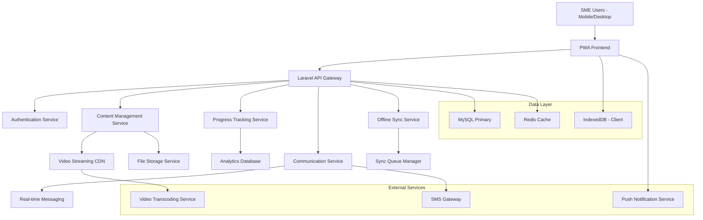

# IFL TAF Cohort 5 - Technical Implementation Guide

## 1. Technical Architecture Overview

### 1.1 Enhanced System Architecture



### 1.2 Technology Stack Enhancement

#### Backend Technologies
- **Framework**: Laravel 10.x with API-first architecture
- **Database**: MySQL 8.0+ with read replicas
- **Caching**: Redis 7.0+ for sessions and application cache
- **Queue System**: Laravel Queues with Redis driver
- **File Storage**: AWS S3 compatible storage with local fallback
- **Video Processing**: FFmpeg with Laravel Media Library

#### Frontend Technologies
- **Progressive Web App**: Service Worker + Cache API
- **Frontend Framework**: Laravel Blade + Alpine.js for reactivity
- **CSS Framework**: Tailwind CSS with custom components
- **Build Tool**: Vite with PWA plugin
- **Offline Storage**: IndexedDB with Dexie.js wrapper

#### Mobile & Offline Technologies
- **Service Worker**: Workbox for advanced caching strategies
- **Background Sync**: For offline data synchronization
- **Push Notifications**: Web Push API with VAPID
- **Local Database**: IndexedDB for offline data persistence

## 2. Database Schema Enhancements

### 2.1 New Tables for IFL TAF Requirements

```sql
-- SME Organizations Management
CREATE TABLE sme_organizations (
    id BIGINT UNSIGNED AUTO_INCREMENT PRIMARY KEY,
    name VARCHAR(255) NOT NULL,
    code VARCHAR(50) UNIQUE NOT NULL,
    location VARCHAR(255),
    region VARCHAR(100),
    contact_person VARCHAR(255),
    contact_email VARCHAR(255),
    contact_phone VARCHAR(50),
    connectivity_level ENUM('high', 'medium', 'low') DEFAULT 'medium',
    business_sector VARCHAR(100),
    employee_count INT,
    status ENUM('active', 'inactive', 'suspended') DEFAULT 'active',
    created_at TIMESTAMP DEFAULT CURRENT_TIMESTAMP,
    updated_at TIMESTAMP DEFAULT CURRENT_TIMESTAMP ON UPDATE CURRENT_TIMESTAMP
);

-- Enhanced Users Table (modify existing)
ALTER TABLE users ADD COLUMN sme_organization_id BIGINT UNSIGNED NULL;
ALTER TABLE users ADD COLUMN connectivity_preference ENUM('high', 'medium', 'low') DEFAULT 'medium';
ALTER TABLE users ADD COLUMN offline_content_limit INT DEFAULT 1024; -- MB
ALTER TABLE users ADD COLUMN last_sync_at TIMESTAMP NULL;
ALTER TABLE users ADD COLUMN device_info JSON NULL;
ALTER TABLE users ADD FOREIGN KEY (sme_organization_id) REFERENCES sme_organizations(id);

-- Offline Sync Queue
CREATE TABLE offline_sync_queue (
    id BIGINT UNSIGNED AUTO_INCREMENT PRIMARY KEY,
    user_id BIGINT UNSIGNED NOT NULL,
    action_type VARCHAR(50) NOT NULL, -- 'progress_update', 'forum_post', 'quiz_attempt'
    entity_type VARCHAR(50) NOT NULL, -- 'lesson', 'course', 'forum', 'quiz'
    entity_id BIGINT UNSIGNED NOT NULL,
    data JSON NOT NULL,
    sync_status ENUM('pending', 'processing', 'synced', 'failed') DEFAULT 'pending',
    priority INT DEFAULT 5, -- 1-10, lower is higher priority
    attempts INT DEFAULT 0,
    last_attempt_at TIMESTAMP NULL,
    created_at TIMESTAMP DEFAULT CURRENT_TIMESTAMP,
    synced_at TIMESTAMP NULL,
    FOREIGN KEY (user_id) REFERENCES users(id) ON DELETE CASCADE,
    INDEX idx_sync_status (sync_status),
    INDEX idx_user_pending (user_id, sync_status)
);

-- Content Downloads Tracking
CREATE TABLE content_downloads (
    id BIGINT UNSIGNED AUTO_INCREMENT PRIMARY KEY,
    user_id BIGINT UNSIGNED NOT NULL,
    content_type ENUM('video', 'document', 'lesson', 'course_package') NOT NULL,
    content_id BIGINT UNSIGNED NOT NULL,
    file_path VARCHAR(500),
    file_size BIGINT, -- bytes
    download_status ENUM('queued', 'downloading', 'completed', 'failed', 'expired') DEFAULT 'queued',
    download_progress INT DEFAULT 0, -- percentage
    quality_level VARCHAR(20), -- for videos: '720p', '480p', '360p'
    expires_at TIMESTAMP NULL,
    downloaded_at TIMESTAMP NULL,
    created_at TIMESTAMP DEFAULT CURRENT_TIMESTAMP,
    FOREIGN KEY (user_id) REFERENCES users(id) ON DELETE CASCADE,
    INDEX idx_user_status (user_id, download_status),
    INDEX idx_expiry (expires_at)
);

-- Enhanced Progress Tracking
CREATE TABLE detailed_progress_tracking (
    id BIGINT UNSIGNED AUTO_INCREMENT PRIMARY KEY,
    user_id BIGINT UNSIGNED NOT NULL,
    lesson_id BIGINT UNSIGNED NOT NULL,
    session_id VARCHAR(100), -- for tracking individual study sessions
    time_spent INT DEFAULT 0, -- seconds
    video_progress JSON, -- {"current_time": 120, "total_duration": 300, "segments_watched": [...]}
    interaction_data JSON, -- clicks, scrolls, quiz attempts, etc.
    completion_percentage INT DEFAULT 0,
    is_offline_session BOOLEAN DEFAULT FALSE,
    device_type VARCHAR(50),
    created_at TIMESTAMP DEFAULT CURRENT_TIMESTAMP,
    updated_at TIMESTAMP DEFAULT CURRENT_TIMESTAMP ON UPDATE CURRENT_TIMESTAMP,
    FOREIGN KEY (user_id) REFERENCES users(id) ON DELETE CASCADE,
    FOREIGN KEY (lesson_id) REFERENCES lessons(id) ON DELETE CASCADE,
    INDEX idx_user_lesson (user_id, lesson_id),
    INDEX idx_session (session_id)
);

-- Communication & Forums Enhancement
CREATE TABLE forum_categories (
    id BIGINT UNSIGNED AUTO_INCREMENT PRIMARY KEY,
    name VARCHAR(255) NOT NULL,
    description TEXT,
    course_id BIGINT UNSIGNED NULL, -- NULL for general forums
    sme_organization_id BIGINT UNSIGNED NULL, -- for organization-specific forums
    is_moderated BOOLEAN DEFAULT TRUE,
    sort_order INT DEFAULT 0,
    status ENUM('active', 'inactive') DEFAULT 'active',
    created_at TIMESTAMP DEFAULT CURRENT_TIMESTAMP,
    FOREIGN KEY (course_id) REFERENCES courses(id) ON DELETE CASCADE,
    FOREIGN KEY (sme_organization_id) REFERENCES sme_organizations(id) ON DELETE CASCADE
);

CREATE TABLE forum_topics (
    id BIGINT UNSIGNED AUTO_INCREMENT PRIMARY KEY,
    category_id BIGINT UNSIGNED NOT NULL,
    user_id BIGINT UNSIGNED NOT NULL,
    title VARCHAR(255) NOT NULL,
    content TEXT NOT NULL,
    is_pinned BOOLEAN DEFAULT FALSE,
    is_locked BOOLEAN DEFAULT FALSE,
    view_count INT DEFAULT 0,
    reply_count INT DEFAULT 0,
    last_reply_at TIMESTAMP NULL,
    last_reply_user_id BIGINT UNSIGNED NULL,
    status ENUM('active', 'hidden', 'deleted') DEFAULT 'active',
    created_at TIMESTAMP DEFAULT CURRENT_TIMESTAMP,
    updated_at TIMESTAMP DEFAULT CURRENT_TIMESTAMP ON UPDATE CURRENT_TIMESTAMP,
    FOREIGN KEY (category_id) REFERENCES forum_categories(id) ON DELETE CASCADE,
    FOREIGN KEY (user_id) REFERENCES users(id) ON DELETE CASCADE,
    FOREIGN KEY (last_reply_user_id) REFERENCES users(id) ON DELETE SET NULL,
    INDEX idx_category_status (category_id, status),
    INDEX idx_last_reply (last_reply_at DESC)
);

CREATE TABLE forum_replies (
    id BIGINT UNSIGNED AUTO_INCREMENT PRIMARY KEY,
    topic_id BIGINT UNSIGNED NOT NULL,
    user_id BIGINT UNSIGNED NOT NULL,
    parent_reply_id BIGINT UNSIGNED NULL, -- for nested replies
    content TEXT NOT NULL,
    is_solution BOOLEAN DEFAULT FALSE, -- mark as solution for Q&A
    like_count INT DEFAULT 0,
    status ENUM('active', 'hidden', 'deleted') DEFAULT 'active',
    created_at TIMESTAMP DEFAULT CURRENT_TIMESTAMP,
    updated_at TIMESTAMP DEFAULT CURRENT_TIMESTAMP ON UPDATE CURRENT_TIMESTAMP,
    FOREIGN KEY (topic_id) REFERENCES forum_topics(id) ON DELETE CASCADE,
    FOREIGN KEY (user_id) REFERENCES users(id) ON DELETE CASCADE,
    FOREIGN KEY (parent_reply_id) REFERENCES forum_replies(id) ON DELETE CASCADE,
    INDEX idx_topic_status (topic_id, status),
    INDEX idx_created (created_at DESC)
);

-- Video Content Enhancement
CREATE TABLE video_content (
    id BIGINT UNSIGNED AUTO_INCREMENT PRIMARY KEY,
    lesson_id BIGINT UNSIGNED NOT NULL,
    original_file_path VARCHAR(500),
    duration INT, -- seconds
    file_size BIGINT, -- bytes
    video_qualities JSON, -- {"720p": "/path/to/720p.mp4", "480p": "/path/to/480p.mp4"}
    thumbnail_path VARCHAR(500),
    subtitle_files JSON, -- {"en": "/path/to/en.vtt", "am": "/path/to/am.vtt"}
    chapters JSON, -- [{"title": "Introduction", "start_time": 0}, ...]
    processing_status ENUM('pending', 'processing', 'completed', 'failed') DEFAULT 'pending',
    is_downloadable BOOLEAN DEFAULT TRUE,
    download_expiry_days INT DEFAULT 30,
    created_at TIMESTAMP DEFAULT CURRENT_TIMESTAMP,
    updated_at TIMESTAMP DEFAULT CURRENT_TIMESTAMP ON UPDATE CURRENT_TIMESTAMP,
    FOREIGN KEY (lesson_id) REFERENCES lessons(id) ON DELETE CASCADE,
    INDEX idx_lesson (lesson_id),
    INDEX idx_processing_status (processing_status)
);

-- Notifications & Announcements
CREATE TABLE notifications (
    id BIGINT UNSIGNED AUTO_INCREMENT PRIMARY KEY,
    user_id BIGINT UNSIGNED NULL, -- NULL for broadcast notifications
    sme_organization_id BIGINT UNSIGNED NULL, -- for organization-specific notifications
    course_id BIGINT UNSIGNED NULL, -- for course-specific notifications
    type VARCHAR(50) NOT NULL, -- 'announcement', 'course_update', 'forum_reply', 'system'
    title VARCHAR(255) NOT NULL,
    message TEXT NOT NULL,
    action_url VARCHAR(500) NULL,
    priority ENUM('low', 'medium', 'high', 'urgent') DEFAULT 'medium',
    delivery_method SET('web', 'push', 'sms', 'email') DEFAULT 'web',
    is_read BOOLEAN DEFAULT FALSE,
    read_at TIMESTAMP NULL,
    expires_at TIMESTAMP NULL,
    created_at TIMESTAMP DEFAULT CURRENT_TIMESTAMP,
    FOREIGN KEY (user_id) REFERENCES users(id) ON DELETE CASCADE,
    FOREIGN KEY (sme_organization_id) REFERENCES sme_organizations(id) ON DELETE CASCADE,
    FOREIGN KEY (course_id) REFERENCES courses(id) ON DELETE CASCADE,
    INDEX idx_user_read (user_id, is_read),
    INDEX idx_created (created_at DESC)
);

-- System Settings for IFL TAF
INSERT INTO settings (key_name, value, type, group_name) VALUES
('offline_content_max_size', '2048', 'number', 'offline'), -- MB per user
('video_quality_levels', '["360p", "480p", "720p"]', 'json', 'video'),
('default_video_quality', '480p', 'text', 'video'),
('content_expiry_days', '30', 'number', 'offline'),
('sync_retry_attempts', '3', 'number', 'offline'),
('low_bandwidth_threshold', '1000', 'number', 'connectivity'), -- kbps
('sms_notifications_enabled', '1', 'boolean', 'notifications'),
('forum_moderation_enabled', '1', 'boolean', 'communication'),
('auto_download_enabled', '0', 'boolean', 'offline'),
('ifl_taf_branding', '{"logo": "", "primary_color": "#007bff", "secondary_color": "#6c757d"}', 'json', 'branding');
```

## 3. API Specifications

### 3.1 Offline Sync API Endpoints

```php
// routes/api.php additions

// Offline Sync Management
Route::middleware(['auth:sanctum'])->group(function () {
    // Sync queue management
    Route::post('/sync/queue', [OfflineSyncController::class, 'addToQueue']);
    Route::get('/sync/pending', [OfflineSyncController::class, 'getPendingSync']);
    Route::post('/sync/process', [OfflineSyncController::class, 'processSyncBatch']);
    Route::delete('/sync/{id}', [OfflineSyncController::class, 'removeSyncItem']);
    
    // Content download management
    Route::get('/content/downloadable', [ContentDownloadController::class, 'getDownloadableContent']);
    Route::post('/content/download/request', [ContentDownloadController::class, 'requestDownload']);
    Route::get('/content/download/status', [ContentDownloadController::class, 'getDownloadStatus']);
    Route::delete('/content/download/{id}', [ContentDownloadController::class, 'cancelDownload']);
    
    // Progress tracking
    Route::post('/progress/track', [ProgressTrackingController::class, 'trackProgress']);
    Route::get('/progress/detailed/{lessonId}', [ProgressTrackingController::class, 'getDetailedProgress']);
    Route::post('/progress/bulk-update', [ProgressTrackingController::class, 'bulkUpdateProgress']);
    
    // Video streaming
    Route::get('/video/{id}/stream', [VideoStreamingController::class, 'streamVideo']);
    Route::get('/video/{id}/qualities', [VideoStreamingController::class, 'getAvailableQualities']);
    Route::get('/video/{id}/subtitles/{lang}', [VideoStreamingController::class, 'getSubtitles']);
    
    // Forum API
    Route::apiResource('forums/categories', ForumCategoryController::class);
    Route::apiResource('forums/topics', ForumTopicController::class);
    Route::apiResource('forums/replies', ForumReplyController::class);
    Route::post('/forums/replies/{id}/like', [ForumReplyController::class, 'toggleLike']);
    
    // SME Organization management
    Route::apiResource('sme-organizations', SMEOrganizationController::class);
    Route::get('/sme-organizations/{id}/users', [SMEOrganizationController::class, 'getUsers']);
    Route::get('/sme-organizations/{id}/analytics', [SMEOrganizationController::class, 'getAnalytics']);
    
    // Notifications
    Route::get('/notifications', [NotificationController::class, 'getUserNotifications']);
    Route::post('/notifications/{id}/read', [NotificationController::class, 'markAsRead']);
    Route::post('/notifications/read-all', [NotificationController::class, 'markAllAsRead']);
});

// Public API for connectivity testing
Route::get('/connectivity/test', [ConnectivityController::class, 'testConnection']);
Route::get('/connectivity/bandwidth', [ConnectivityController::class, 'measureBandwidth']);
```

### 3.2 API Response Formats

```php
// Standardized API Response Format
class ApiResponse
{
    public static function success($data = null, $message = 'Success', $meta = [])
    {
        return response()->json([
            'status' => 'success',
            'message' => $message,
            'data' => $data,
            'meta' => $meta,
            'timestamp' => now()->toISOString(),
        ]);
    }
    
    public static function error($message = 'Error', $errors = [], $code = 400)
    {
        return response()->json([
            'status' => 'error',
            'message' => $message,
            'errors' => $errors,
            'timestamp' => now()->toISOString(),
        ], $code);
    }
    
    public static function offline($data = null, $syncId = null)
    {
        return response()->json([
            'status' => 'offline_queued',
            'message' => 'Action queued for sync when online',
            'data' => $data,
            'sync_id' => $syncId,
            'timestamp' => now()->toISOString(),
        ]);
    }
}
```

## 4. Progressive Web App Implementation

### 4.1 Service Worker Configuration

```javascript
// public/sw.js - Service Worker
import { precacheAndRoute, cleanupOutdatedCaches } from 'workbox-precaching';
import { registerRoute } from 'workbox-routing';
import { StaleWhileRevalidate, CacheFirst, NetworkFirst } from 'workbox-strategies';
import { BackgroundSync } from 'workbox-background-sync';

// Precache static assets
precacheAndRoute(self.__WB_MANIFEST);
cleanupOutdatedCaches();

// Cache strategies for different content types

// API calls - Network first with background sync
registerRoute(
    ({ url }) => url.pathname.startsWith('/api/'),
    new NetworkFirst({
        cacheName: 'api-cache',
        networkTimeoutSeconds: 10,
        plugins: [
            {
                cacheKeyWillBeUsed: async ({ request }) => {
                    return `${request.url}?v=${Date.now()}`;
                }
            }
        ]
    })
);

// Video content - Cache first
registerRoute(
    ({ request }) => request.destination === 'video',
    new CacheFirst({
        cacheName: 'video-cache',
        plugins: [
            {
                cacheWillUpdate: async ({ response }) => {
                    return response.status === 200;
                }
            }
        ]
    })
);

// Documents and images - Stale while revalidate
registerRoute(
    ({ request }) => request.destination === 'document' || request.destination === 'image',
    new StaleWhileRevalidate({
        cacheName: 'content-cache'
    })
);

// Background sync for offline actions
const bgSync = new BackgroundSync('offline-sync-queue', {
    maxRetentionTime: 24 * 60 // Retry for max of 24 Hours (specified in minutes)
});

registerRoute(
    /\/api\/sync\//,
    bgSync.replayWhenOnline,
    'POST'
);

// Push notification handling
self.addEventListener('push', event => {
    const options = {
        body: event.data ? event.data.text() : 'New notification',
        icon: '/icons/icon-192x192.png',
        badge: '/icons/badge-72x72.png',
        vibrate: [100, 50, 100],
        data: {
            dateOfArrival: Date.now(),
            primaryKey: 1
        },
        actions: [
            {
                action: 'explore',
                title: 'View',
                icon: '/icons/checkmark.png'
            },
            {
                action: 'close',
                title: 'Close',
                icon: '/icons/xmark.png'
            }
        ]
    };
    
    event.waitUntil(
        self.registration.showNotification('UNDO LMS', options)
    );
});
```

### 4.2 Frontend Offline Management

```javascript
// resources/js/offline-manager.js
class OfflineManager {
    constructor() {
        this.isOnline = navigator.onLine;
        this.syncQueue = [];
        this.initializeEventListeners();
        this.initializeIndexedDB();
    }
    
    initializeEventListeners() {
        window.addEventListener('online', () => {
            this.isOnline = true;
            this.processSyncQueue();
            this.showConnectionStatus('online');
        });
        
        window.addEventListener('offline', () => {
            this.isOnline = false;
            this.showConnectionStatus('offline');
        });
    }
    
    async initializeIndexedDB() {
        this.db = await this.openDB('UndoLMS', 1, {
            upgrade(db) {
                // Store for offline content
                if (!db.objectStoreNames.contains('content')) {
                    const contentStore = db.createObjectStore('content', { keyPath: 'id' });
                    contentStore.createIndex('type', 'type');
                    contentStore.createIndex('courseId', 'courseId');
                }
                
                // Store for sync queue
                if (!db.objectStoreNames.contains('syncQueue')) {
                    const syncStore = db.createObjectStore('syncQueue', { keyPath: 'id', autoIncrement: true });
                    syncStore.createIndex('timestamp', 'timestamp');
                    syncStore.createIndex('type', 'type');
                }
                
                // Store for user progress
                if (!db.objectStoreNames.contains('progress')) {
                    const progressStore = db.createObjectStore('progress', { keyPath: 'lessonId' });
                    progressStore.createIndex('courseId', 'courseId');
                    progressStore.createIndex('lastUpdated', 'lastUpdated');
                }
            }
        });
    }
    
    async addToSyncQueue(action) {
        const syncItem = {
            ...action,
            timestamp: Date.now(),
            attempts: 0,
            status: 'pending'
        };
        
        // Store in IndexedDB
        await this.db.add('syncQueue', syncItem);
        
        // If online, try to sync immediately
        if (this.isOnline) {
            this.processSyncQueue();
        }
    }
    
    async processSyncQueue() {
        const pendingItems = await this.db.getAll('syncQueue');
        
        for (const item of pendingItems) {
            try {
                await this.syncItem(item);
                await this.db.delete('syncQueue', item.id);
            } catch (error) {
                console.error('Sync failed for item:', item, error);
                item.attempts++;
                
                if (item.attempts >= 3) {
                    item.status = 'failed';
                } else {
                    item.status = 'retry';
                }
                
                await this.db.put('syncQueue', item);
            }
        }
    }
    
    async syncItem(item) {
        const response = await fetch('/api/sync/process', {
            method: 'POST',
            headers: {
                'Content-Type': 'application/json',
                'Authorization': `Bearer ${this.getAuthToken()}`
            },
            body: JSON.stringify(item)
        });
        
        if (!response.ok) {
            throw new Error(`Sync failed: ${response.statusText}`);
        }
        
        return response.json();
    }
    
    async downloadContent(contentId, type, quality = 'medium') {
        try {
            const response = await fetch(`/api/content/download/${contentId}?quality=${quality}`);
            const blob = await response.blob();
            
            // Store in IndexedDB
            await this.db.put('content', {
                id: contentId,
                type: type,
                data: blob,
                downloadedAt: Date.now(),
                quality: quality
            });
            
            return true;
        } catch (error) {
            console.error('Download failed:', error);
            return false;
        }
    }
    
    async getOfflineContent(contentId) {
        return await this.db.get('content', contentId);
    }
    
    showConnectionStatus(status) {
        const statusElement = document.getElementById('connection-status');
        if (statusElement) {
            statusElement.className = `connection-status ${status}`;
            statusElement.textContent = status === 'online' ? 'Connected' : 'Offline Mode';
        }
    }
    
    getAuthToken() {
        return localStorage.getItem('auth_token') || sessionStorage.getItem('auth_token');
    }
    
    openDB(name, version, { upgrade }) {
        return new Promise((resolve, reject) => {
            const request = indexedDB.open(name, version);
            
            request.onerror = () => reject(request.error);
            request.onsuccess = () => resolve(request.result);
            request.onupgradeneeded = () => upgrade(request.result);
        });
    }
}

// Initialize offline manager
const offlineManager = new OfflineManager();
window.offlineManager = offlineManager;
```

## 5. Video Streaming Implementation

### 5.1 Adaptive Video Player

```javascript
// resources/js/video-player.js
class AdaptiveVideoPlayer {
    constructor(containerId, videoData) {
        this.container = document.getElementById(containerId);
        this.videoData = videoData;
        this.currentQuality = 'auto';
        this.bandwidthMonitor = new BandwidthMonitor();
        this.initializePlayer();
    }
    
    initializePlayer() {
        this.video = document.createElement('video');
        this.video.controls = true;
        this.video.preload = 'metadata';
        
        // Create quality selector
        this.createQualitySelector();
        
        // Create download button
        this.createDownloadButton();
        
        // Monitor bandwidth and adjust quality
        this.bandwidthMonitor.onBandwidthChange = (bandwidth) => {
            if (this.currentQuality === 'auto') {
                this.adjustQualityBasedOnBandwidth(bandwidth);
            }
        };
        
        this.container.appendChild(this.video);
        this.loadVideo();
    }
    
    createQualitySelector() {
        const qualitySelector = document.createElement('select');
        qualitySelector.className = 'quality-selector';
        
        // Add auto option
        const autoOption = document.createElement('option');
        autoOption.value = 'auto';
        autoOption.textContent = 'Auto';
        qualitySelector.appendChild(autoOption);
        
        // Add available qualities
        Object.keys(this.videoData.qualities).forEach(quality => {
            const option = document.createElement('option');
            option.value = quality;
            option.textContent = quality;
            qualitySelector.appendChild(option);
        });
        
        qualitySelector.addEventListener('change', (e) => {
            this.changeQuality(e.target.value);
        });
        
        this.container.appendChild(qualitySelector);
    }
    
    createDownloadButton() {
        const downloadBtn = document.createElement('button');
        downloadBtn.className = 'download-btn';
        downloadBtn.textContent = 'Download for Offline';
        downloadBtn.addEventListener('click', () => this.downloadVideo());
        
        this.container.appendChild(downloadBtn);
    }
    
    adjustQualityBasedOnBandwidth(bandwidth) {
        let targetQuality = '360p';
        
        if (bandwidth > 2000) { // > 2 Mbps
            targetQuality = '720p';
        } else if (bandwidth > 1000) { // > 1 Mbps
            targetQuality = '480p';
        }
        
        if (this.videoData.qualities[targetQuality]) {
            this.changeQuality(targetQuality);
        }
    }
    
    changeQuality(quality) {
        const currentTime = this.video.currentTime;
        const wasPlaying = !this.video.paused;
        
        if (quality === 'auto') {
            this.currentQuality = 'auto';
            this.bandwidthMonitor.start();
        } else {
            this.currentQuality = quality;
            this.bandwidthMonitor.stop();
            this.video.src = this.videoData.qualities[quality];
            this.video.currentTime = currentTime;
            
            if (wasPlaying) {
                this.video.play();
            }
        }
    }
    
    async downloadVideo() {
        const quality = this.currentQuality === 'auto' ? '480p' : this.currentQuality;
        
        try {
            const success = await window.offlineManager.downloadContent(
                this.videoData.id,
                'video',
                quality
            );
            
            if (success) {
                this.showMessage('Video downloaded for offline viewing');
            } else {
                this.showMessage('Download failed. Please try again.', 'error');
            }
        } catch (error) {
            this.showMessage('Download failed. Please check your connection.', 'error');
        }
    }
    
    async loadVideo() {
        // Check if video is available offline first
        const offlineVideo = await window.offlineManager.getOfflineContent(this.videoData.id);
        
        if (offlineVideo && !navigator.onLine) {
            // Load from offline storage
            const videoUrl = URL.createObjectURL(offlineVideo.data);
            this.video.src = videoUrl;
        } else {
            // Load from server with adaptive quality
            this.changeQuality(this.currentQuality);
        }
    }
    
    showMessage(message, type = 'success') {
        const messageDiv = document.createElement('div');
        messageDiv.className = `video-message ${type}`;
        messageDiv.textContent = message;
        
        this.container.appendChild(messageDiv);
        
        setTimeout(() => {
            messageDiv.remove();
        }, 3000);
    }
}

class BandwidthMonitor {
    constructor() {
        this.isMonitoring = false;
        this.onBandwidthChange = null;
    }
    
    start() {
        if (this.isMonitoring) return;
        
        this.isMonitoring = true;
        this.monitor();
    }
    
    stop() {
        this.isMonitoring = false;
    }
    
    async monitor() {
        while (this.isMonitoring) {
            try {
                const bandwidth = await this.measureBandwidth();
                if (this.onBandwidthChange) {
                    this.onBandwidthChange(bandwidth);
                }
            } catch (error) {
                console.error('Bandwidth measurement failed:', error);
            }
            
            // Wait 30 seconds before next measurement
            await new Promise(resolve => setTimeout(resolve, 30000));
        }
    }
    
    async measureBandwidth() {
        const startTime = Date.now();
        const response = await fetch('/api/connectivity/bandwidth', {
            cache: 'no-cache'
        });
        const endTime = Date.now();
        
        const duration = (endTime - startTime) / 1000; // seconds
        const bytes = parseInt(response.headers.get('content-length') || '0');
        const bitsPerSecond = (bytes * 8) / duration;
        const kbps = bitsPerSecond / 1000;
        
        return kbps;
    }
}
```

## 6. Implementation Timeline

### 6.1 Development Phases

#### Phase 1: Foundation (Weeks 1-4)
- [ ] Database schema implementation
- [ ] Basic API endpoints for offline sync
- [ ] Service Worker setup and PWA configuration
- [ ] User management enhancements for SME organizations
- [ ] Basic offline storage implementation

#### Phase 2: Content Management (Weeks 5-8)
- [ ] Video upload and transcoding system
- [ ] Adaptive video player implementation
- [ ] Content download management
- [ ] Document and presentation handling
- [ ] Search and categorization features

#### Phase 3: Learning Features (Weeks 9-12)
- [ ] Enhanced progress tracking system
- [ ] Detailed analytics and reporting
- [ ] Forum and communication tools
- [ ] Notification system implementation
- [ ] Mobile responsiveness optimization

#### Phase 4: Advanced Features (Weeks 13-16)
- [ ] Background sync optimization
- [ ] Bandwidth monitoring and adaptive quality
- [ ] Push notification implementation
- [ ] SMS integration for low-connectivity areas
- [ ] Advanced caching strategies

#### Phase 5: Testing & Deployment (Weeks 17-20)
- [ ] Comprehensive testing in low-bandwidth environments
- [ ] User acceptance testing with SME representatives
- [ ] Performance optimization and security auditing
- [ ] Documentation and training material creation
- [ ] Production deployment and monitoring setup

### 6.2 Testing Strategy

#### Connectivity Testing
- **Network throttling** to simulate various connection speeds
- **Offline mode testing** for all critical features
- **Intermittent connectivity** testing for sync reliability
- **Mobile network testing** in actual field conditions

#### Performance Testing
- **Load testing** with concurrent users
- **Video streaming** performance under various conditions
- **Database performance** with large datasets
- **Cache efficiency** and storage optimization

#### User Experience Testing
- **Usability testing** with actual SME users
- **Accessibility testing** for inclusive design
- **Cross-browser compatibility** testing
- **Mobile device testing** across different screen sizes

## 7. Deployment & Monitoring

### 7.1 Production Environment Setup

```yaml
# docker-compose.yml for production
version: '3.8'
services:
  app:
    build: .
    ports:
      - "80:80"
      - "443:443"
    environment:
      - APP_ENV=production
      - APP_DEBUG=false
    volumes:
      - ./storage:/var/www/html/storage
      - ./public/uploads:/var/www/html/public/uploads
    depends_on:
      - mysql
      - redis
      
  mysql:
    image: mysql:8.0
    environment:
      MYSQL_ROOT_PASSWORD: ${DB_PASSWORD}
      MYSQL_DATABASE: ${DB_DATABASE}
    volumes:
      - mysql_data:/var/lib/mysql
      
  redis:
    image: redis:7-alpine
    volumes:
      - redis_data:/data
      
  nginx:
    image: nginx:alpine
    ports:
      - "80:80"
      - "443:443"
    volumes:
      - ./nginx.conf:/etc/nginx/nginx.conf
      - ./ssl:/etc/nginx/ssl
      
volumes:
  mysql_data:
  redis_data:
```

### 7.2 Monitoring & Analytics

```php
// app/Services/AnalyticsService.php
class AnalyticsService
{
    public function trackUserEngagement($userId, $action, $data = [])
    {
        DB::table('user_analytics')->insert([
            'user_id' => $userId,
            'action' => $action,
            'data' => json_encode($data),
            'ip_address' => request()->ip(),
            'user_agent' => request()->userAgent(),
            'created_at' => now()
        ]);
    }
    
    public function getConnectivityStats()
    {
        return DB::table('user_analytics')
            ->where('action', 'connectivity_check')
            ->selectRaw('DATE(created_at) as date, AVG(JSON_EXTRACT(data, "$.bandwidth")) as avg_bandwidth')
            ->groupBy('date')
            ->orderBy('date', 'desc')
            ->limit(30)
            ->get();
    }
    
    public function getSMEOrganizationProgress($organizationId)
    {
        return DB::table('users')
            ->join('enrollments', 'users.id', '=', 'enrollments.user_id')
            ->join('courses', 'enrollments.course_id', '=', 'courses.id')
            ->where('users.sme_organization_id', $organizationId)
            ->selectRaw('courses.title, AVG(enrollments.progress_percentage) as avg_progress, COUNT(enrollments.id) as total_enrollments')
            ->groupBy('courses.id', 'courses.title')
            ->get();
    }
}
```

This technical implementation guide provides the foundation for developing the enhanced UNDO LMS platform to meet the IFL TAF Cohort 5 requirements. The implementation focuses on offline-first architecture, adaptive content delivery, and comprehensive user management suitable for SME training in low-connectivity environments.