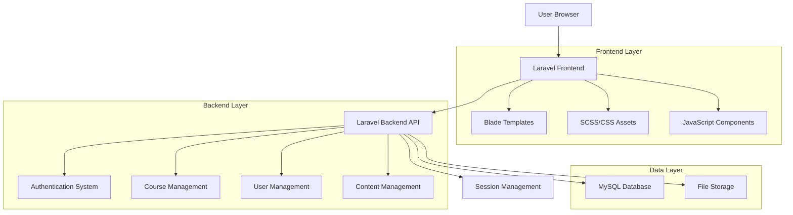

# UNDO LMS Technical Architecture Document

## 1. Architecture Design



## 2. Technology Description

* **Frontend**: Laravel Blade Templates + Bootstrap 5 + Custom SCSS + Vanilla JavaScript

* **Backend**: Laravel 10.x Framework

* **Database**: MySQL 8.0+

* **Storage**: Local File System

* **Authentication**: Laravel Sanctum

* **Caching**: File-based caching

* **Session**: File-based sessions

## 3. Route Definitions

| Route                 | Purpose                                         |
| --------------------- | ----------------------------------------------- |
| `/`                   | Home page with course listings and hero section |
| `/login`              | User authentication page                        |
| `/register`           | User registration page                          |
| `/dashboard`          | User dashboard with enrolled courses            |
| `/courses`            | Course catalog and search                       |
| `/courses/{id}`       | Individual course details page                  |
| `/courses/{id}/learn` | Course learning interface                       |
| `/profile`            | User profile management                         |
| `/admin`              | Admin panel dashboard                           |
| `/admin/courses`      | Course management interface                     |
| `/admin/users`        | User management interface                       |
| `/admin/settings`     | System settings and configuration               |

## 4. Core Modules Structure

### 4.1 Remaining Modules (After Cleanup)

| Module     | Purpose                                  | Status   |
| ---------- | ---------------------------------------- | -------- |
| `Course`   | Course management and delivery           | Active   |
| `Customer` | User/student management                  | Active   |
| `Blog`     | Content marketing and articles           | Active   |
| `Faq`      | Frequently asked questions               | Active   |
| `Frontend` | Public-facing pages                      | Active   |
| `Language` | Multi-language support                   | Active   |
| `Location` | Geographic features                      | Active   |
| `Badges`   | Achievement system                       | Active   |
| `Brand`    | Branding and customization               | Active   |
| `Coupon`   | Discount system (non-payment)            | Modified |
| `Currency` | Currency display (no payment processing) | Modified |

### 4.2 Removed Modules

| Module          | Reason for Removal            |
| --------------- | ----------------------------- |
| `BasicPayment`  | Payment gateway functionality |
| `BkashPG`       | Third-party payment service   |
| `MercadoPagoPG` | Third-party payment service   |
| `Order`         | Payment-dependent ordering    |
| `Refund`        | Payment-dependent refunds     |

## 5. Data Model

### 5.1 Core Entity Relationships

```PHP
erDiagram
    USER ||--o{ ENROLLMENT : enrolls
    USER ||--o{ BLOG_POST : creates
    USER ||--o{ USER_BADGE : earns
    COURSE ||--o{ ENROLLMENT : has
    COURSE ||--o{ LESSON : contains
    COURSE ||--o{ COURSE_CATEGORY : belongs_to
    LESSON ||--o{ LESSON_PROGRESS : tracks
    BADGE ||--o{ USER_BADGE : awarded
    
    USER {
        int id PK
        string name
        string email
        string password
        string role
        timestamp created_at
        timestamp updated_at
    }
    
    COURSE {
        int id PK
        string title
        text description
        string thumbnail
        string status
        int instructor_id FK
        int category_id FK
        timestamp created_at
        timestamp updated_at
    }
    
    ENROLLMENT {
        int id PK
        int user_id FK
        int course_id FK
        string status
        timestamp enrolled_at
        timestamp completed_at
    }
    
    LESSON {
        int id PK
        int course_id FK
        string title
        text content
        string video_url
        int order
        timestamp created_at
        timestamp updated_at
    }
    
    COURSE_CATEGORY {
        int id PK
        string name
        string slug
        text description
        string icon
        timestamp created_at
        timestamp updated_at
    }
    
    BADGE {
        int id PK
        string name
        text description
        string image
        string condition_type
        int condition_value
        timestamp created_at
        timestamp updated_at
    }
    
    USER_BADGE {
        int id PK
        int user_id FK
        int badge_id FK
        timestamp earned_at
    }
    
    LESSON_PROGRESS {
        int id PK
        int user_id FK
        int lesson_id FK
        boolean completed
        int progress_percentage
        timestamp last_accessed
    }
```

### 5.2 Data Definition Language

#### Core Tables

```sql
-- Users table (modified to remove payment-related fields)
CREATE TABLE users (
    id BIGINT UNSIGNED AUTO_INCREMENT PRIMARY KEY,
    name VARCHAR(255) NOT NULL,
    email VARCHAR(255) UNIQUE NOT NULL,
    email_verified_at TIMESTAMP NULL,
    password VARCHAR(255) NOT NULL,
    role ENUM('student', 'instructor', 'admin') DEFAULT 'student',
    avatar VARCHAR(255) NULL,
    bio TEXT NULL,
    status ENUM('active', 'inactive', 'suspended') DEFAULT 'active',
    created_at TIMESTAMP DEFAULT CURRENT_TIMESTAMP,
    updated_at TIMESTAMP DEFAULT CURRENT_TIMESTAMP ON UPDATE CURRENT_TIMESTAMP
);

-- Courses table (simplified without pricing)
CREATE TABLE courses (
    id BIGINT UNSIGNED AUTO_INCREMENT PRIMARY KEY,
    title VARCHAR(255) NOT NULL,
    slug VARCHAR(255) UNIQUE NOT NULL,
    description TEXT,
    thumbnail VARCHAR(255),
    video_preview VARCHAR(255),
    level ENUM('beginner', 'intermediate', 'advanced') DEFAULT 'beginner',
    duration_hours INT DEFAULT 0,
    status ENUM('draft', 'published', 'archived') DEFAULT 'draft',
    instructor_id BIGINT UNSIGNED,
    category_id BIGINT UNSIGNED,
    featured BOOLEAN DEFAULT FALSE,
    created_at TIMESTAMP DEFAULT CURRENT_TIMESTAMP,
    updated_at TIMESTAMP DEFAULT CURRENT_TIMESTAMP ON UPDATE CURRENT_TIMESTAMP,
    FOREIGN KEY (instructor_id) REFERENCES users(id) ON DELETE SET NULL,
    FOREIGN KEY (category_id) REFERENCES course_categories(id) ON DELETE SET NULL
);

-- Enrollments table (free enrollment only)
CREATE TABLE enrollments (
    id BIGINT UNSIGNED AUTO_INCREMENT PRIMARY KEY,
    user_id BIGINT UNSIGNED NOT NULL,
    course_id BIGINT UNSIGNED NOT NULL,
    status ENUM('active', 'completed', 'dropped') DEFAULT 'active',
    progress_percentage INT DEFAULT 0,
    enrolled_at TIMESTAMP DEFAULT CURRENT_TIMESTAMP,
    completed_at TIMESTAMP NULL,
    FOREIGN KEY (user_id) REFERENCES users(id) ON DELETE CASCADE,
    FOREIGN KEY (course_id) REFERENCES courses(id) ON DELETE CASCADE,
    UNIQUE KEY unique_enrollment (user_id, course_id)
);

-- Course categories
CREATE TABLE course_categories (
    id BIGINT UNSIGNED AUTO_INCREMENT PRIMARY KEY,
    name VARCHAR(255) NOT NULL,
    slug VARCHAR(255) UNIQUE NOT NULL,
    description TEXT,
    icon VARCHAR(255),
    color VARCHAR(7) DEFAULT '#007bff',
    parent_id BIGINT UNSIGNED NULL,
    sort_order INT DEFAULT 0,
    status ENUM('active', 'inactive') DEFAULT 'active',
    created_at TIMESTAMP DEFAULT CURRENT_TIMESTAMP,
    updated_at TIMESTAMP DEFAULT CURRENT_TIMESTAMP ON UPDATE CURRENT_TIMESTAMP,
    FOREIGN KEY (parent_id) REFERENCES course_categories(id) ON DELETE SET NULL
);

-- Lessons table
CREATE TABLE lessons (
    id BIGINT UNSIGNED AUTO_INCREMENT PRIMARY KEY,
    course_id BIGINT UNSIGNED NOT NULL,
    title VARCHAR(255) NOT NULL,
    slug VARCHAR(255) NOT NULL,
    content LONGTEXT,
    video_url VARCHAR(500),
    video_duration INT DEFAULT 0,
    lesson_type ENUM('video', 'text', 'quiz', 'assignment') DEFAULT 'video',
    sort_order INT DEFAULT 0,
    is_preview BOOLEAN DEFAULT FALSE,
    status ENUM('active', 'inactive') DEFAULT 'active',
    created_at TIMESTAMP DEFAULT CURRENT_TIMESTAMP,
    updated_at TIMESTAMP DEFAULT CURRENT_TIMESTAMP ON UPDATE CURRENT_TIMESTAMP,
    FOREIGN KEY (course_id) REFERENCES courses(id) ON DELETE CASCADE
);

-- Settings table (cleaned of payment configurations)
CREATE TABLE settings (
    id BIGINT UNSIGNED AUTO_INCREMENT PRIMARY KEY,
    key_name VARCHAR(255) UNIQUE NOT NULL,
    value LONGTEXT,
    type ENUM('text', 'textarea', 'number', 'boolean', 'json') DEFAULT 'text',
    group_name VARCHAR(100) DEFAULT 'general',
    created_at TIMESTAMP DEFAULT CURRENT_TIMESTAMP,
    updated_at TIMESTAMP DEFAULT CURRENT_TIMESTAMP ON UPDATE CURRENT_TIMESTAMP
);

-- Initial settings data
INSERT INTO settings (key_name, value, type, group_name) VALUES
('app_name', 'UNDO', 'text', 'general'),
('app_description', 'UNDO Learning Management System', 'textarea', 'general'),
('primary_color', '#007bff', 'text', 'appearance'),
('secondary_color', '#6c757d', 'text', 'appearance'),
('logo', '', 'text', 'appearance'),
('favicon', '', 'text', 'appearance'),
('allow_registration', '1', 'boolean', 'general'),
('default_user_role', 'student', 'text', 'general'),
('course_auto_approval', '0', 'boolean', 'courses'),
('enable_certificates', '1', 'boolean', 'courses');

-- Create indexes for performance
CREATE INDEX idx_courses_status ON courses(status);
CREATE INDEX idx_courses_featured ON courses(featured);
CREATE INDEX idx_enrollments_user ON enrollments(user_id);
CREATE INDEX idx_enrollments_course ON enrollments(course_id);
CREATE INDEX idx_lessons_course ON lessons(course_id);
CREATE INDEX idx_lessons_order ON lessons(sort_order);
```

## 6. Security Architecture

### 6.1 Authentication & Authorization

* **Authentication**: Laravel Sanctum for API tokens

* **Authorization**: Role-based access control (RBAC)

* **Password Security**: Bcrypt hashing

* **Session Management**: Secure session handling

### 6.2 Data Protection

* **Input Validation**: Laravel Form Requests

* **SQL Injection Prevention**: Eloquent ORM

* **XSS Protection**: Blade template escaping

* **CSRF Protection**: Laravel CSRF tokens

## 7. Performance Considerations

### 7.1 Caching Strategy

* **Application Cache**: File-based caching for settings

* **View Cache**: Blade template compilation

* **Route Cache**: Optimized route resolution

* **Config Cache**: Cached configuration files

### 7.2 Database Optimization

* **Indexing**: Strategic database indexes

* **Query Optimization**: Eager loading relationships

* **Connection Pooling**: Efficient database connections

## 8. Deployment Architecture

### 8.1 Server Requirements

* **PHP**: 8.1 or higher

* **Web Server**: Apache/Nginx

* **Database**: MySQL 8.0+

* **Storage**: Local file system

* **Memory**: 512MB minimum

### 8.2 Environment Configuration

```env
# Core Application
APP_NAME=UNDO
APP_ENV=production
APP_KEY=base64:generated_key_here
APP_DEBUG=false
APP_URL=https://your-domain.com

# Database
DB_CONNECTION=mysql
DB_HOST=127.0.0.1
DB_PORT=3306
DB_DATABASE=undo_lms
DB_USERNAME=your_username
DB_PASSWORD=your_password

# Cache & Sessions
CACHE_DRIVER=file
SESSION_DRIVER=file
SESSION_LIFETIME=120

# Mail Configuration
MAIL_MAILER=smtp
MAIL_HOST=your_smtp_host
MAIL_PORT=587
MAIL_USERNAME=your_email
MAIL_PASSWORD=your_password
MAIL_ENCRYPTION=tls
MAIL_FROM_ADDRESS=noreply@your-domain.com
MAIL_FROM_NAME="UNDO LMS"
```

This architecture provides a clean, simplified LMS system focused on core learning functionality without the complexity of payment processing or external service dependencies.
