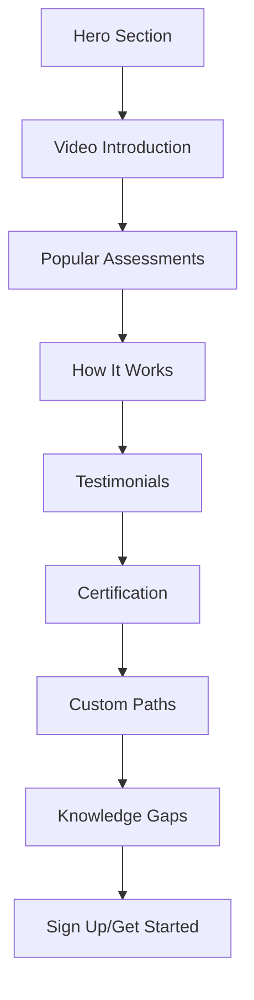

# SkillGro LMS Homepage Redesign - Product Requirements Document

## 1. Product Overview
Redesign the SkillGro LMS homepage to match a modern Pluralsight-style design with focus on skill assessment and learning paths. The new homepage will transform the current basic layout into a professional, gradient-rich interface that emphasizes skill development, assessments, and personalized learning experiences.

## 2. Core Features

### 2.1 Feature Module
Our homepage redesign consists of the following main sections:
1. **Hero Section**: Gradient background, skill assessment focus, call-to-action button
2. **Video Introduction Section**: Embedded video with descriptive content
3. **Popular Skill Assessments**: Course cards with technology logos and course counts
4. **How It Works Section**: Step-by-step process explanation with visual elements
5. **Customer Testimonials**: Quote section with customer photos and company details
6. **Certification Section**: Professional certification showcase with visual elements
7. **Custom Learning Paths**: Personalized learning journey section
8. **Knowledge Gaps Section**: Skills assessment and improvement tracking

### 2.2 Page Details

| Section Name | Module Name | Feature Description |
|--------------|-------------|--------------------|
| Hero Section | Main Banner | Display gradient background (purple to orange), skill assessment headline "Learn what you don't know. Prove what you do.", descriptive text about benchmarking skills, "Get started" CTA button, professional illustration with laptop and charts |
| Video Introduction | Video Player | Show video thumbnail with play button, "This is not a test" headline, explanatory text about skill development future, "Watch the video" link |
| Popular Assessments | Course Cards | Display 4 course cards (Microsoft Azure, Python 3, AWS Operations, R), show course counts, technology logos, skill level indicators, "View path" links |
| How It Works | Process Steps | Three-step process: Create account, Take assessment, Receive Skill IQ, include visual mockups and explanatory text |
| Testimonials | Customer Quote | Feature customer testimonial with photo, quote text, customer name and title, company information |
| Certification | Cert Showcase | Display certification badges, "Prepare to become certifiably awesome" headline, certification description text, "Learn more" CTA |
| Custom Paths | Learning Journey | "Build a custom path" section with app mockup, description of tailored learning |
| Knowledge Gaps | Skills Analysis | Dashboard mockup showing skill assessment results, "Identify your knowledge gaps" headline, gap analysis description |

## 3. Core Process

User journey through the new homepage:
1. User lands on hero section and sees skill assessment value proposition
2. User watches introduction video to understand the platform
3. User browses popular skill assessments and selects relevant technology
4. User learns about the assessment process through "How it works" section
5. User reads customer testimonials for social proof
6. User explores certification opportunities
7. User discovers custom learning paths option
8. User understands knowledge gap identification benefits
9. User clicks CTA buttons to start their learning journey

## 4. User Interface Design

### 4.1 Design Style
- **Primary Colors**: Deep purple (#3B2F5C), bright pink (#E91E63), orange gradient (#FF6B35)
- **Secondary Colors**: White (#FFFFFF), light gray (#F5F5F5), dark navy (#1A1A2E)
- **Button Style**: Rounded corners, gradient backgrounds, hover effects
- **Typography**: Modern sans-serif fonts, bold headings, clean body text
- **Layout Style**: Full-width sections, card-based content, generous white space
- **Visual Elements**: Gradient backgrounds, professional illustrations, technology logos, mockup images

### 4.2 Page Design Overview

| Section Name | Module Name | UI Elements |
|--------------|-------------|-------------|
| Hero Section | Main Banner | Purple to orange gradient background, white text overlay, professional illustration on right, rounded CTA button with pink background |
| Video Introduction | Video Player | Light gray background, video thumbnail with blue play button, pink accent border, clean typography |
| Popular Assessments | Course Cards | Dark navy background, white cards with technology logos, course count badges, rounded corners, hover effects |
| How It Works | Process Steps | White background, colorful step indicators, mockup images, clean layout with ample spacing |
| Testimonials | Customer Quote | Dark navy background, large quote marks, customer photo with rounded corners, pink accent elements |
| Certification | Cert Showcase | Light background, certification badge graphics, professional layout, orange CTA button |
| Custom Paths | Learning Journey | White background, app mockup on right, clean text layout, professional styling |
| Knowledge Gaps | Skills Analysis | Light gray background, dashboard mockup, pink CTA button, modern card design |

### 4.3 Responsiveness
The homepage is designed mobile-first with responsive breakpoints for tablet and desktop. Touch-friendly buttons and optimized layouts for all screen sizes. Gradient backgrounds adapt smoothly across devices, and card layouts stack appropriately on mobile.