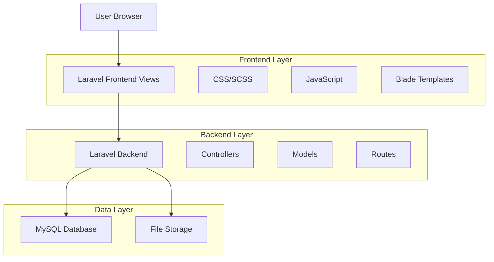
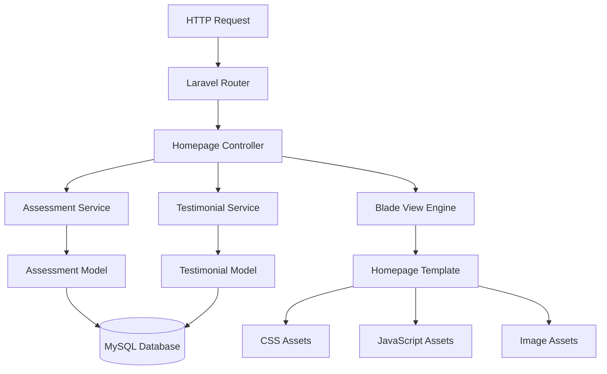
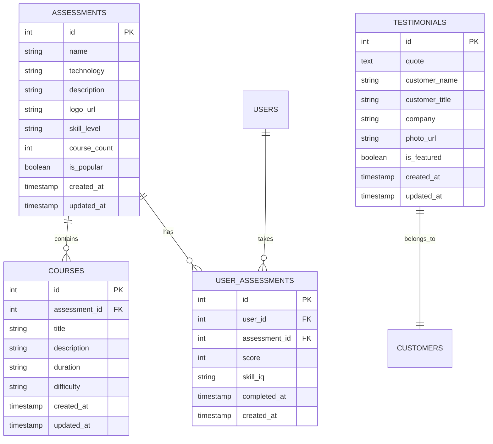

# SkillGro Homepage Redesign - Technical Architecture Document

## 1. Architecture Design



## 2. Technology Description

* Frontend: Laravel Blade Templates + CSS3/SCSS + Vanilla JavaScript

* Backend: Laravel 10+ (existing framework)

* Database: MySQL (existing)

* Styling: Custom CSS with gradients, Flexbox/Grid layouts

* Assets: Local image storage, optimized graphics

## 3. Route Definitions

| Route        | Purpose                                          |
| ------------ | ------------------------------------------------ |
| /            | Homepage with new Pluralsight-style design       |
| /courses     | Course listing page (existing, may need updates) |
| /assessments | Skill assessments page                           |
| /login       | User authentication page                         |
| /register    | User registration page                           |
| /dashboard   | User dashboard (existing admin panel)            |

## 4. API Definitions

### 4.1 Core API

Course and Assessment Data

```
GET /api/popular-assessments
```

Response:

| Param Name    | Param Type | Description                                          |
| ------------- | ---------- | ---------------------------------------------------- |
| assessments   | array      | List of popular skill assessments                    |
| id            | integer    | Assessment ID                                        |
| name          | string     | Assessment name (e.g., "Microsoft Azure Deployment") |
| technology    | string     | Technology type                                      |
| course\_count | integer    | Number of courses in path                            |
| logo\_url     | string     | Technology logo image URL                            |
| skill\_level  | string     | Beginner/Intermediate/Advanced                       |

Example:

```json
{
  "assessments": [
    {
      "id": 1,
      "name": "Microsoft Azure Deployment",
      "technology": "Azure",
      "course_count": 4,
      "logo_url": "/images/azure-logo.png",
      "skill_level": "Intermediate"
    },
    {
      "id": 2,
      "name": "Python 3",
      "technology": "Python",
      "course_count": 12,
      "logo_url": "/images/python-logo.png",
      "skill_level": "Beginner"
    }
  ]
}
```

Testimonials Data

```
GET /api/testimonials
```

Response:

| Param Name      | Param Type | Description               |
| --------------- | ---------- | ------------------------- |
| testimonials    | array      | Customer testimonial data |
| quote           | string     | Customer testimonial text |
| customer\_name  | string     | Customer full name        |
| customer\_title | string     | Job title                 |
| company         | string     | Company name              |
| photo\_url      | string     | Customer photo URL        |

## 5. Server Architecture



## 6. Data Model

### 6.1 Data Model Definition



### 6.2 Data Definition Language

Assessments Table

```sql
-- Create assessments table
CREATE TABLE assessments (
    id BIGINT UNSIGNED AUTO_INCREMENT PRIMARY KEY,
    name VARCHAR(255) NOT NULL,
    technology VARCHAR(100) NOT NULL,
    description TEXT,
    logo_url VARCHAR(500),
    skill_level ENUM('Beginner', 'Intermediate', 'Advanced') DEFAULT 'Beginner',
    course_count INT DEFAULT 0,
    is_popular BOOLEAN DEFAULT FALSE,
    created_at TIMESTAMP DEFAULT CURRENT_TIMESTAMP,
    updated_at TIMESTAMP DEFAULT CURRENT_TIMESTAMP ON UPDATE CURRENT_TIMESTAMP
);

-- Create index
CREATE INDEX idx_assessments_popular ON assessments(is_popular);
CREATE INDEX idx_assessments_technology ON assessments(technology);

-- Insert sample data
INSERT INTO assessments (name, technology, description, logo_url, skill_level, course_count, is_popular) VALUES
('Microsoft Azure Deployment', 'Azure', 'Learn Azure cloud deployment strategies', '/images/azure-logo.png', 'Intermediate', 4, TRUE),
('Python 3', 'Python', 'Master Python programming fundamentals', '/images/python-logo.png', 'Beginner', 12, TRUE),
('AWS Operations', 'AWS', 'AWS cloud operations and management', '/images/aws-logo.png', 'Intermediate', 7, TRUE),
('Cleaning Data with R', 'R', 'Data cleaning and analysis with R', '/images/r-logo.png', 'Advanced', 5, TRUE);
```

Testimonials Table

```sql
-- Create testimonials table
CREATE TABLE testimonials (
    id BIGINT UNSIGNED AUTO_INCREMENT PRIMARY KEY,
    quote TEXT NOT NULL,
    customer_name VARCHAR(255) NOT NULL,
    customer_title VARCHAR(255),
    company VARCHAR(255),
    photo_url VARCHAR(500),
    is_featured BOOLEAN DEFAULT FALSE,
    created_at TIMESTAMP DEFAULT CURRENT_TIMESTAMP,
    updated_at TIMESTAMP DEFAULT CURRENT_TIMESTAMP ON UPDATE CURRENT_TIMESTAMP
);

-- Create index
CREATE INDEX idx_testimonials_featured ON testimonials(is_featured);

-- Insert sample data
INSERT INTO testimonials (quote, customer_name, customer_title, company, photo_url, is_featured) VALUES
('Pluralsight allows us to not only use Skill IQ to see if someone\'s really great at something, or perhaps needs some help, but also provides courses and paths so we can make sure we\'re standardizing across teams and across the company.', 'Sarah Waters', 'Workforce Strategy and People Transformation Lead', 'BT Digital', '/images/sarah-waters.jpg', TRUE);
```

User Assessments Table

```sql
-- Create user_assessments table
CREATE TABLE user_assessments (
    id BIGINT UNSIGNED AUTO_INCREMENT PRIMARY KEY,
    user_id BIGINT UNSIGNED NOT NULL,
    assessment_id BIGINT UNSIGNED NOT NULL,
    score INT DEFAULT 0,
    skill_iq VARCHAR(50),
    completed_at TIMESTAMP NULL,
    created_at TIMESTAMP DEFAULT CURRENT_TIMESTAMP,
    FOREIGN KEY (user_id) REFERENCES users(id) ON DELETE CASCADE,
    FOREIGN KEY (assessment_id) REFERENCES assessments(id) ON DELETE CASCADE
);

-- Create indexes
CREATE INDEX idx_user_assessments_user ON user_assessments(user_id);
CREATE INDEX idx_user_assessments_assessment ON user_assessments(assessment_id);
CREATE INDEX idx_user_assessments_completed ON user_assessments(completed_at);
```

